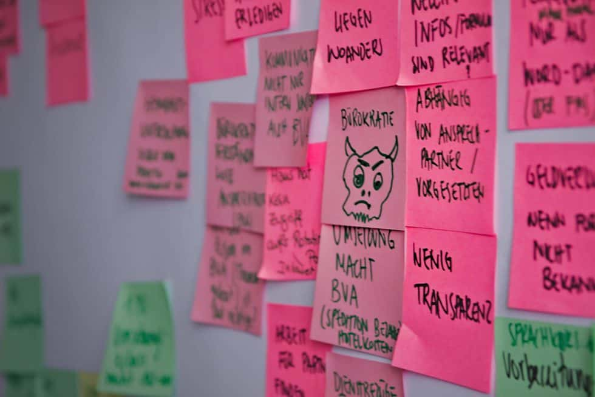

#  **Rotationsportal der Diplomaten AA 2019**

Jeden Sommer wechseln über 2.000 Mitarbeiter:innen des Auswärtigen Dienstes den Dienstort. Ab 2020 können sie die erste Version des Rotationsplaners nutzen, der ihnen die anstehenden Aufgaben rund um die Rotation – zugeschnitten auf ihre persönlichen Lebensumstände – auflistet.

### [Case Study](https://medium.com/tech4germany/fallstudie-rotationsportal-planungstool-zur-unterst%C3%BCtzung-der-rotation-15d852f494b8)

# Ausgangslage

Die Rotation bringt für die Beschäftigten des Auswärtigen Dienstes eine Fülle von Aufgaben und Herausforderungen mit sich. Nicht nur der Umzug als solcher, auch die Wohnungssuche, neue Schulunterbringung für die Kinder, die Berufstätigkeit der Partner_in, erforderliche Impfungen, etc. müssen organisiert werden. Trotz fachlicher und finanzieller Unterstützung des Auswärtigen Amtes, finden sie sich bei der Planung und Umsetzung einer Rotation jedes Mal aufs Neue in einem Spannungsfeld zwischen persönlichen Bedürfnissen und den komplexen, bürokratischen Vorgaben. Die Menge an Bürokratie und das unübersichtliche Informationsangebot im Planungsprozess bringen Ungewissheit, Überforderung, Stress; unter Umständen wird finanzielle Unterstützung mangels Kenntnis nicht in Anspruch genommen.

# Herausforderungen der Rotation

## 1 Die Rotierenden

Das Auswärtige Amt bietet bisher keine auf die persönlichen Lebenslagen der Rotierenden zugeschnittene Unterstützung an. Rotierende sehen sich mit einer unübersichtlichen Fülle von Aufgaben konfrontiert und vermissen einen Überblick über relevante Inhalte für ihre Rotation.

## 2 Die Fachreferate

Die Mitarbeiter:innen der Fachreferate sind durch die hohen Nach- und Rückfragen stark belastet und haben das Bedürfnis, die Rotierenden mit einem gut strukturierten Informationsangebot besser zu unterstützen. 

## 3 Das Auswärtige Amt

Als Folge der Rotation und ihrer umfangreichen Vorbereitung ist über einen Zeitraum von mehreren Monaten die Arbeitseffizienz der Mitarbeiter:innen reduziert. Digitalisierung würde an der Stelle einen Effizienzgewinn bedeuten.

# Zielsetzung

Um das Rotationsportal anwenderfreundlicher zu gestalten, soll  den Rotierenden ein individueller Wegweiser durch den Rotationsprozess zur Verfügung gestellt werden. Das Rotationsportal soll die Planung und Umsetzung der Rotation zentral und als Ganzes unterstützen und somit den Beschäftigten Sicherheit und Wertschätzung vermitteln. 

Wiedergewinn von Arbeitseffizienz und Zeitressourcen

Steigerung der Mitarbeiterloyalität durch angemessene Unterstützung

Nachweis digitaler Kompetenzen im Rahmen der Digitalisierungsstrategie

## Webapp im Sharepoint des Auswärtigen Amtes

# Der Rotationsplaner

Bildet zum ersten Mal den Prozess der Rotation ganzheitlich und zentral ab und bietet in einer personalisierten interaktiven Checkliste einen Überblick über alle anstehenden Aufgaben, ergänzt durch Informationen und Formulare. Die Aufgaben sind übersichtlich nach Kategorien geordnet. Es gibt die Möglichkeit, zu jeder Kategorie eigene Aufgaben hinzuzufügen, und in der Checkliste zu speichern, welche Aufgaben bereits erledigt sind.

# Unsere Ergebnisse sind frei verfügbar

## Prozess

Grobe Auflistung des Arbeitsprozesses und Zwischen-ergebnisse im Rahmen von Tech4Germany. 

### [Download](f1_Prozesspapier.pdf) 

## Umsetzungsplan

Strategiekonzept, Potentiale und Risikobewertung zur Weiterarbeit im Auswärtigen Amt.

### [Download](f2_Umsetzungsplan_Veröffentlichung-auf-Projektseite.pdf) 

## Rotationsplaner

GitHub Repository der Webapp, die im Sharepoint des Auswärtigen Amtes läuft.

### [Link](https://github.com/tech4germany/rotationsplaner) 

# Projektteam

Technologie allein ist nicht die Lösung. Wir übergeben eine nutzerzentrierte Webapp an das Auswärtige Amt. Dort muss die Arbeit nun weitergehen. Es müssen Organisationsstrukturen und Arbeitsweisen geschaffen werden, die das Rotationsportal pflegen, anpassen und weiterentwickeln.

**Carl Gödecken \
**Engineering Fellow

**Brando Vasquez \
**Design Fellow

**Stephan Detje \
**Engineering Fellow

**Joshua Pacheco \
**Service Designer

# Projektpartner

**Stephanie Weidner \
**Digitallotsin

**Daniela Weber \
**Digitallotsin
