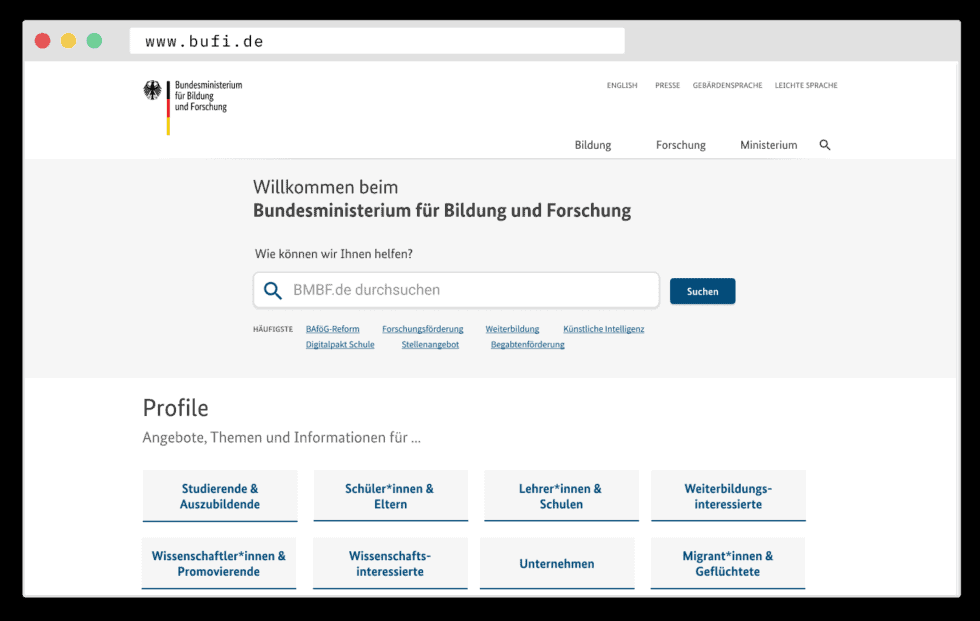
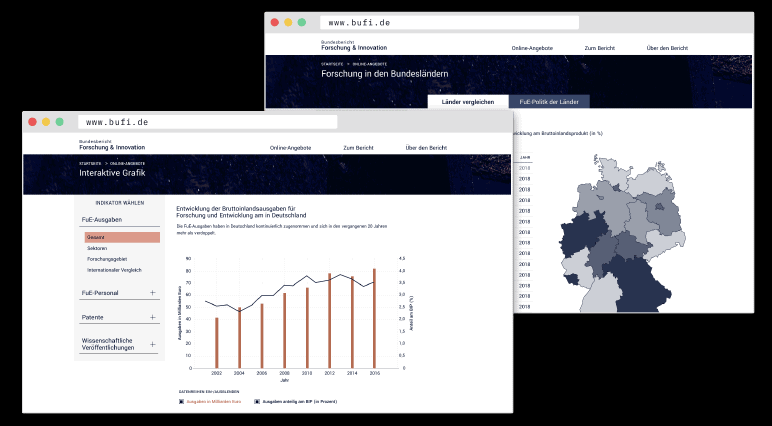

# **Webauftritt BMBF 2019**

Wie können Haupt- und Fachseiten von Ministerien nutzerzentriert gestaltet werden? Wir zeigen am Beispiel des Bundesministeriums für Bildung & Forschung wie Webauftritte aussehen, die sich an den Bedürfnissen der Nutzer:innen und Bürger:innen orientieren, anstatt an internen Strukturen.

### [Case Study Ministeriumswebseite](https://medium.com/tech4germany/fallstudie-ministeriumswebseite-der-zukunft-5579641ab865)

### [Case Study BuFI](https://medium.com/tech4germany/fallstudie-bufi-infoplattform-zu-bildung-und-forschung-d7e10af51e22)

# +++ Bundesbericht Forschung und Innovation im neuen Design +++

Nach der Prototypisierung durch Tech4Germany wurde der Bundesbericht Forschung und Innovation (BuFI) 2020 entsprechend der Vorschläge in einem neuen Design veröffentlicht. 

[Jetzt BuFI ansehen](https://www.bundesbericht-forschung-innovation.de/) 

# Eine Herausforderung, zwei Projekte

Wie können Ministerien Bürger:innen und Nutzer:innen in den Fokus Ihres Web-Angebots stellen? Wir zeigen, wie ein nutzerzentriertes und serviceorientiertes Angebot gestaltet sein sollte.

Dazu zeichnen wir die Vision der **Ministeriumswebseite der Zukunft**, auf der Bürger:innen genau die Informationen und Services finden, die sie suchen.

Am Beispiel des **Bundesberichts Forschung und Innovation** zeigen wir, wie selbst ein 400-Seiten langer Bericht durch ein ein attraktives Online-Angebot ergänzt werden kann, das Nutzer:innen einen echten Mehrwert bietet und alle Berichtsdaten offen und zur Weiterverarbeitung zugänglich macht.

# Vorgehen

Um ein nutzerzentriertes Online-Angebot zu erstellen, haben wir Interviews und Nutzertests durchgeführt und Webseitenstatistiken ausgewertet. Mithilfe von Kreativmethoden haben wir verschiedene Ideen entwickelt, die die Probleme der Nutzer:innen lösen könnten und die Besten iterativ weiterentwickelt. Durch den stetigen Einbezug von Nutzerfeedback entstand innerhalb von zehn Wochen ein finales Design.

User Research, Prototyping & Testing, Finales Design

# Die Ministeriumsseite der Zukunft

Direkte Ansprache der Nutzer:innen

Nutzerzentrierte Struktur, die verschiedene Nutzergruppen anspricht und sich nicht an internen Strukturen orientiert

Serviceorientierte Inhalte, die echte Probleme der Bürger:innen lösen

# Übergreifende Empfehlungen für digitale Berührungspunkte

## 1 Nutzerzentrierung

Für viele Bürger:innen ist die gefühlte Distanz zu “denen in Berlin” meist hoch. Umso größer ist das Potenzial nutzerzentrierter digitaler Berührungspunkte zwischen Bundesbehörden und der Gesellschaft. Online-Angebote sollten daher immer den/die Nutzer*in in den Fokus stellen.

## 2 Serviceorientierung

Bürger:innen sind aus privatem und beruflichem Umfeld einfache und nutzerfreundliche Online-Services gewohnt. Dadurch steigt auch die Erwartungshaltung gegenüber staatlichen Akteuren. Digitale Services müssen dabei von Grund auf nutzerzentriert entwickelt werden. Ein analoges Formular, das nicht den Nutzer in den Vordergrund stellt, wird durch die Überführung in ein digitales Format allein nicht nutzerfreundlicher.

## 3 Agile Arbeitsweisen

Durch den Einsatz agiler Arbeitsweisen können kleine Inkremente schnell fertiggestellt werden und damit schon früh Wert für Nutzer:innen geschaffen werden. Gerade in der öffentlichen Verwaltung bedarf es jedoch klarer Signale der Führungsebene, agiles Arbeiten etablieren zu wollen und Räume für diese Arbeitsweisen zu schaffen.

## 4 Open Source

Bei der Erstellung von Anwendungen sollte der Code von Beginn an mit der Öffentlichkeit geteilt werden, sodass alle von der geleisteten Arbeit profitieren können. Das Zurückgreifen auf Open Source Code und Standards anderer Behörden kann ein probates Mittel sein, um in kurzer Zeit, erprobte und nutzerfreundliche Leistungen zu launchen.

## 5 Einheitliche Standards

Wir empfehlen die Etablierung einer zentralen Einheit auf Bundesebene, die Standards für Online-Auftritte und Leistungen definiert und Know-How an die verschiedenen Behörden vermittelt. So kann gewährleistet werden, dass der digitale Auftritt der Bundesbehörden gegenüber Bürger:innen von hoher Qualität und Konsistenz geprägt ist.

# Unsere Ergebnisse sind frei verfügbar

## Dokumentation: 

Vorgehen & Ergebnisse zum Projekt **Ministeriumswebseite der Zukunft**

#### [Download](f1_Dokumentation-BMBF-Short-1.pdf) 

## Dokumentation 

Vorgehen & Ergebnisse zum Projekt Bundesbericht Forschung und Innovation

#### [Download](f2_Dokumentation-BuFI-Short-1.pdf) 

## Design Prototyp

Webauftritt des Bundesbericht Forschung und Innovation

#### [Link](https://www.figma.com/proto/1hBlUSAEgupcsIZVdlZKf1/BuFI-Showcase?node-id=875%3A14933&scaling=min-zoom) 

# Umsetzung: Webauftritt des Bundesbericht Live

#### [Video](v1_BuFI-Promo-Clip-BMBF.mov)

“Der Bericht wird online völlig neu präsentiert: aufgeräumt und übersichtlich, vor allem aber interaktiv. In Zusammenarbeit mit Tech4Germany, der Digitalisierungsinitiative unter der Schirmherrschaft des Bundeskanzleramts, wurde die Website des Bundesberichts nutzerzentriert weiterentwickelt und ist im neuen Look ab jetzt online verfügbar.”

Pressemitteilung 13.05.2020, BMBF

### [Der neue BuFI](https://www.bundesbericht-forschung-innovation.de) 

### [Pressemitteilung BMBF](https://www.bmbf.de/de/karliczek-forschung-und-innovation-sind-unsere-staerke-11580.html) 

# TEAM

**Antonia Borkenhagen \
**Product Fellow

**Katharina Hasenlust \
**Design Fellow

**Sarah Hilker \
**UI/UX Design Fellow

**Carolin Ullrich \
**Product Fellow

# Projektpartner

**Katharina Erbe \
**Digitallotsin

**Martin Kleinemas \
**Digitallotse

 

