# **eRechnung ITZ Bund 2019**

In diesem Projekt haben wir uns aus Nutzer-Sicht mit der Zentralen Rechnungs-Eingangsplattform (ZRE), über welche eRechnungen an öffentliche Auftraggeber versendet werden, beschäftigt und dieses signifikant verbessert.

### [Case Study](https://medium.com/tech4germany/fallstudie-erechnung-redesign-des-erechnungs-portals-des-bundes-67dd3e089b67) 

# +++ e-Rechnung seit November 2020 live +++

Nach der Prototypisierung durch Tech4Germany wurde die e-Rechnung im November 2020 entsprechend der Vorschläge live

geschaltet.

### [Jetzt e-Rechnung ansehen](https://www.e-rechnung-bund.de/)

# HERAUSFORDERUNG

Wie können wir die Benutzerführung für die Rechnungssteller mühelos und mit geringem Zeitaufwand gestalten? Wie können wir die Bekanntheit der eRechnung erhöhen und relevante Informationen für die Rechnungssteller zur Verfügung stellen? Im Laufe des Projekts wurden das Projektziel und der Projektscope erweitert, um den fundamentalen Bedürfnissen der Endanwender gerecht zu werden.
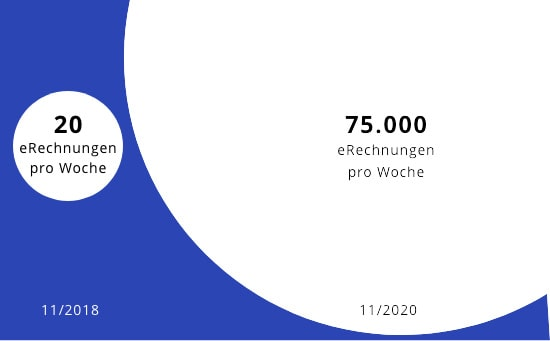

# ZIELSETZUNG

Das Ziel dieses Projektes war nicht nur das gesamte Bedienerlebnis der zentralen Rechnungseingangsplattform des Bundes neu zu gestalten, sondern auch ein Konzept für eine umfassende Serviceplattform zu erarbeitet und in einem High-End funktionalen Prototypen zu implementieren. In dieser Architektur stellt die eRechnung ein Servicemodul dar.

## Verbesserung der User Experience durch intuitiven Formularaufbau und Nutzerführung

## Reduzierung der Eingabezeit mit Hilfe von Templates sowie Import / Export-Funktionalität 

## Experimentelle Evaluierung von Informationsextraktion mit Hilfe von KI / regelbasierten Systemen

# VORGEHENSWEISE

## 1 Research

Die mit den Projektpartnern gemeinsam aufgestellte Hypothesen wurden durch zahlreiche Interviews und Nutzertests verifiziert bzw. falsifiziert. Zudem wurden aus diesen Gesprächen und Tests zusätzliche Insights gewonnen. Diese wurden zusammen mit den sog. Pains und Gains gesammelt, aggregiert und in sog. Personas überführt, welche repräsentativ für die einzelnen Nutzergruppen standen.

## 2 Ideation

Jene Personas bildeten die Grundlage für die sog. WKW-Fragen (Wie könnten wir ...), aus denen in der sog. Ideation-Phase neue Ideen kreiert wurden. Diese wurden dann gesammelt, aggregiert und in potenzielle Features umformuliert.
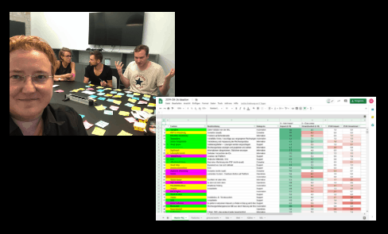

## 3 Decision

Die mehr als 100 Features wurden von jedem Team-Mitglied nach Impact und Machbarkeit bewertet und gemeinsam anhand dieser Kennzahlen priorisiert. Anschließend konnten die Features wieder auf zurück auf die ursprünglichen Nutzer-Bedürfnisse gemappt werden. Anhand dieser Priorisierung wurde dann schlussendlich der neue Projektscope definiert.
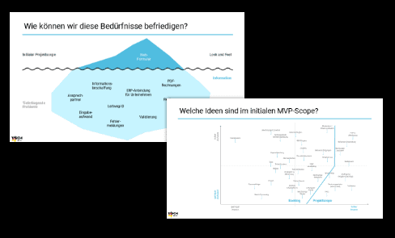

## 4 Conception, Prototyping

In Abstimmung mit den Stakeholdern, wurde die Produktvision anhand eines visuellen Prototypen erarbeitet und kontinuierlich mit potenziellen Nutzern in einemiterativen Prozess getestet. Der erlangte Feedback und dieInsights wurden dann sofort wieder in den Prototypen eingearbeitet.
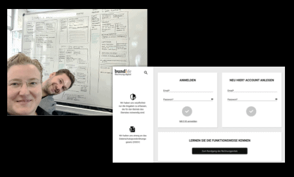

## 5 Umsetzung

Mit Hilfe des visuellen Prototypen wurde ein sog. High fidelity Prototyp entwickelt. Diese Web-Applikation wurde kontinuierlich mit Nutzern getestet und die letzten Änderungen vorgenommen. Aus der Realisierung der Features ergeben sich messbare, signifikante Verbesserungen, wodurch sich die Eingabezeit für eine Rechnung stark dezimiert.
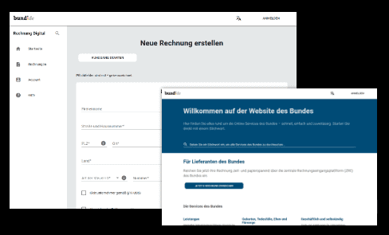

## 6 Vision

Die eRechnung wird von uns als Teil der Servicewelt Bund verstanden. Alle Bürgen können auf dieser einzigen Plattform auf alle, der mehr als 500 Services, zugreifen. Hierbei müssen sie sich nur ein einziges mal einloggen. Alle der verfügbaren Services werden im selben UI / UX dargestellt und sind auf allen Endgeräten bedienbar.
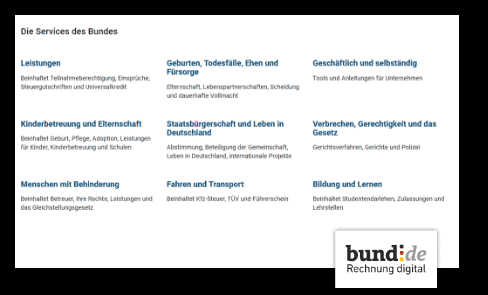

# Eine Plattform

Alle Services des Bundes werden auf einer Plattform gebündelt und – für alle Endgeräte optimiert – dem Bürger, Unternehmen und Organisationen zur Verfügung gestellt.
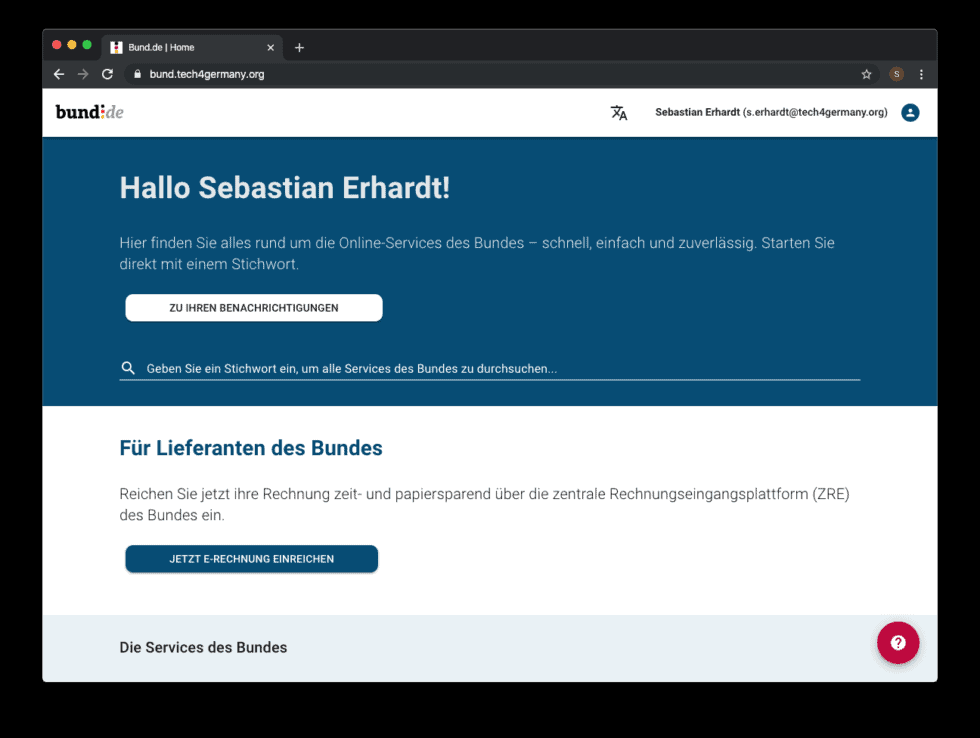

# Onboarding Tour (Rundgang)

Neue Nutzer werden mit Hilfe eines Rundgangs durch die Applikation

abgeholt. Hierbei werden alle Funktionen einfach erklärt. Dieser Rundgang kann jederzeit auf jeder Seite neu gestartet werden.
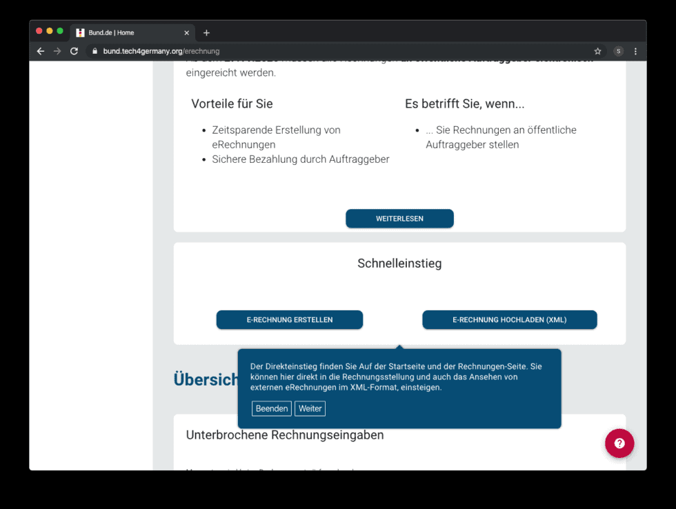

# Mentales Modell / Interaktionen

Die Eingabe der Rechnungsdaten orientiert sich an dem Mentale-Modell einer Papierrechnung, welches die Nutzer bereits kennen.

Alle Interaktions-Flows folgen dem gleichen Prinzip, sodass Nutzer schnell mit der Plattform zurecht kommen.

Daten die der Nutzer einmal eingegeben hat können auf Wunsch gespeichert und bei erneuter Eingabe direkt eingefügt werden.

Rechnungen welche von Drittprogrammen stammen können einfach hochgeladen, angesehen und eingereicht werden.

Alle Rechnungen können ebenfalls ganz einfach exportiert werden.
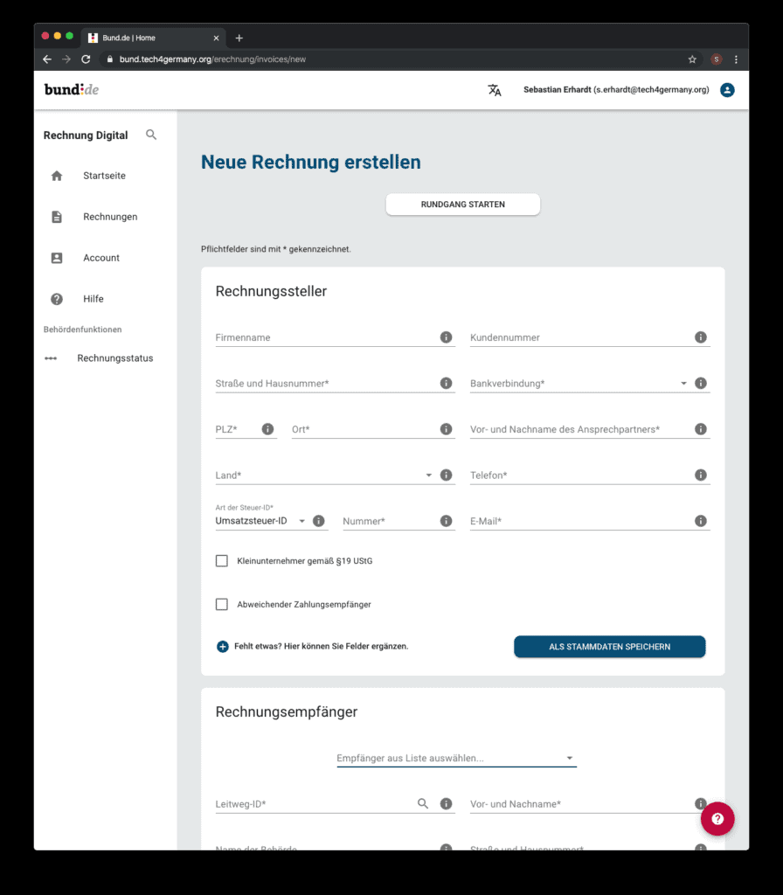

# Hilfe

Eine semantische Suche hilft den Nutzern bei häufigen Fragen schnell zur richtigen Antwort zu kommen.
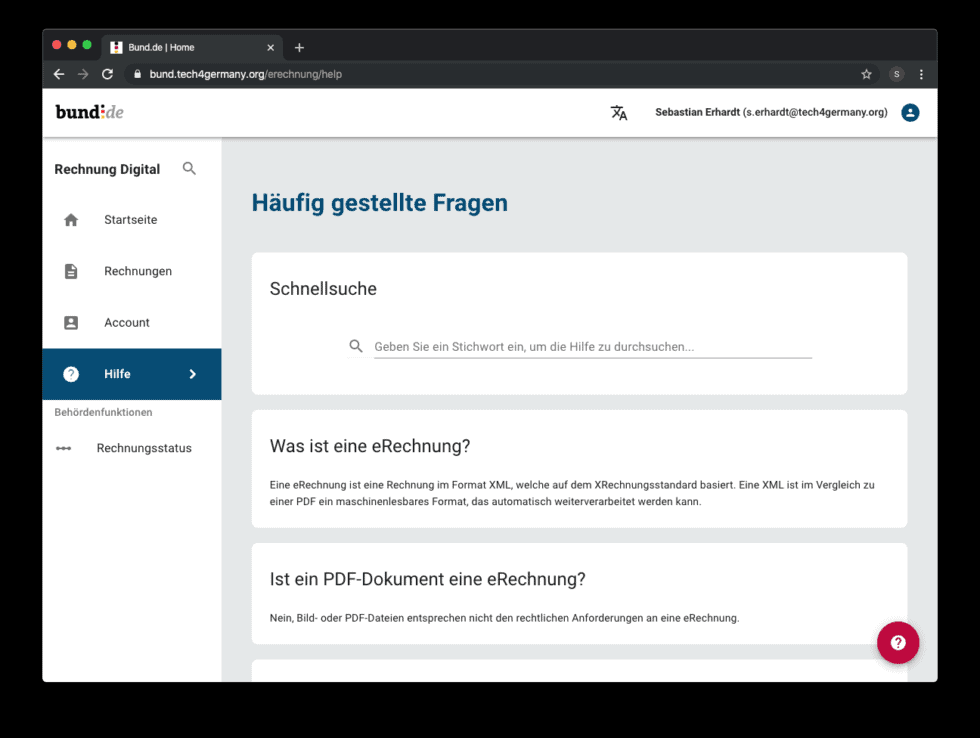

# Informationskampagne 

Für einen schnellen Überblick werden kurz und knapp die wichtigsten Informationen im Bezug auf die eRechnung aufgeführt.

Zusätzlich wird auf die Vorteile der eRechnung verwiesen und konkreten ToDos angezeigt.
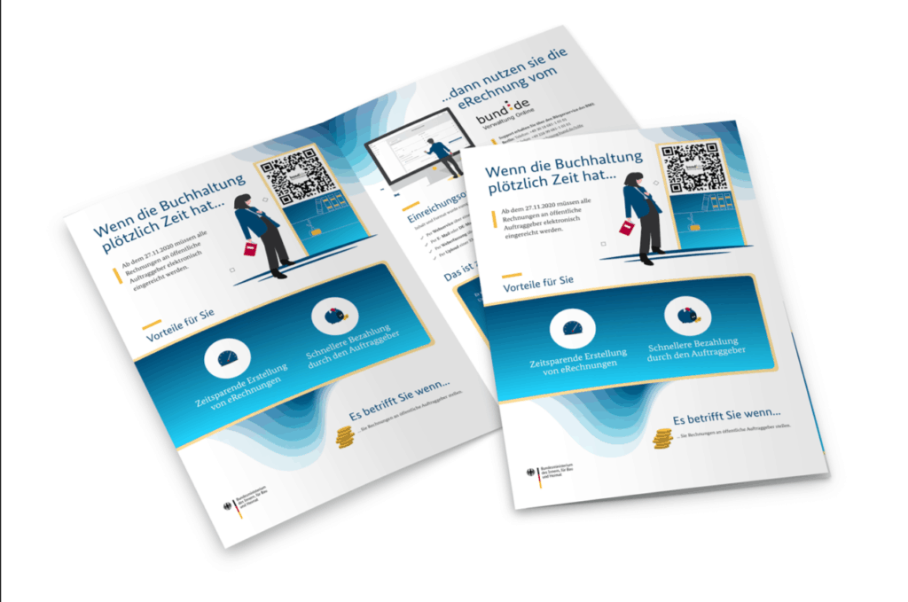

# UNSERE ERGEBNISSE SIND FREI VERFÜGBAR

## P r o j e k t d o k u m e n t a t i o n

Ein umfangreiches Dokument, welches das Projekt und die Vorgehensweise ausführlich beschreibt.

### [Download](Projektdokumentation)

# PROJEKTTEAM

Durch Tech4Germany konnten wir einen tiefen Einblick in die Prozesse und die Arbeitsweise der öffentlichen Verwaltung gewinnen.

Dabei haben wir festgestellt, dass bei der Digitalisierung der Behörden und deren Dienstleistungen noch viel zu tun ist. Wir freuen uns einen kleinen Beitrag dazu geleistet zu haben.

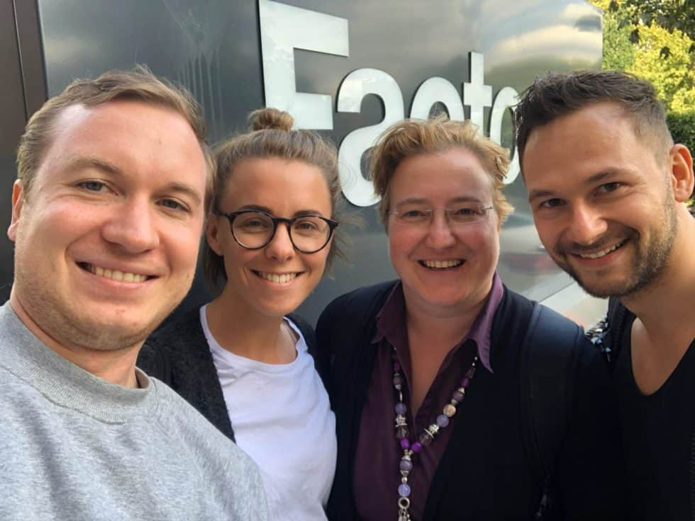

v. L. n. R. Sebastian Erhardt (Engineering Fellow), Katrin Schauer (Design Fellow), Melanie Adelt (Product Fellow), Michael Pernpeintner (Engineering Fellow)

# PROJEKTPARTNER

Arndt Fabrice, Digitallotse

Jan Kriener, Digitallotse

Claudia Hübner, Digitallotsin

Nikolai Jaklitsch, Digitallotse

