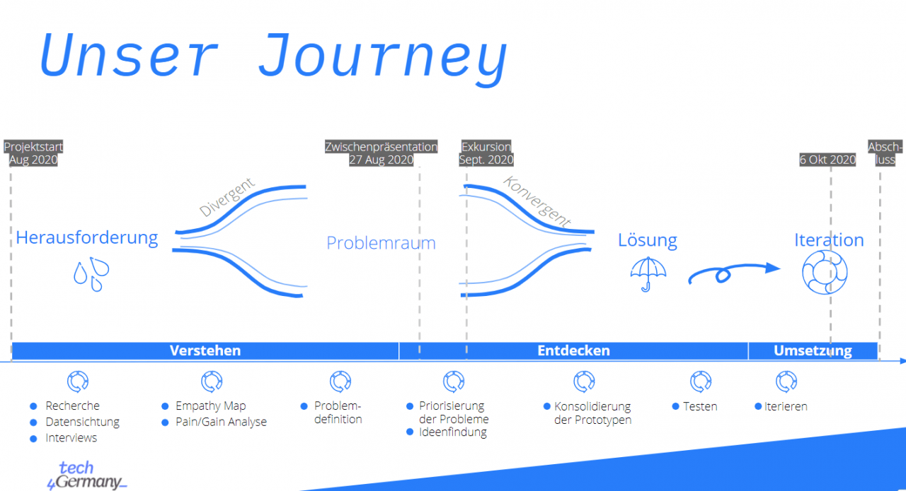
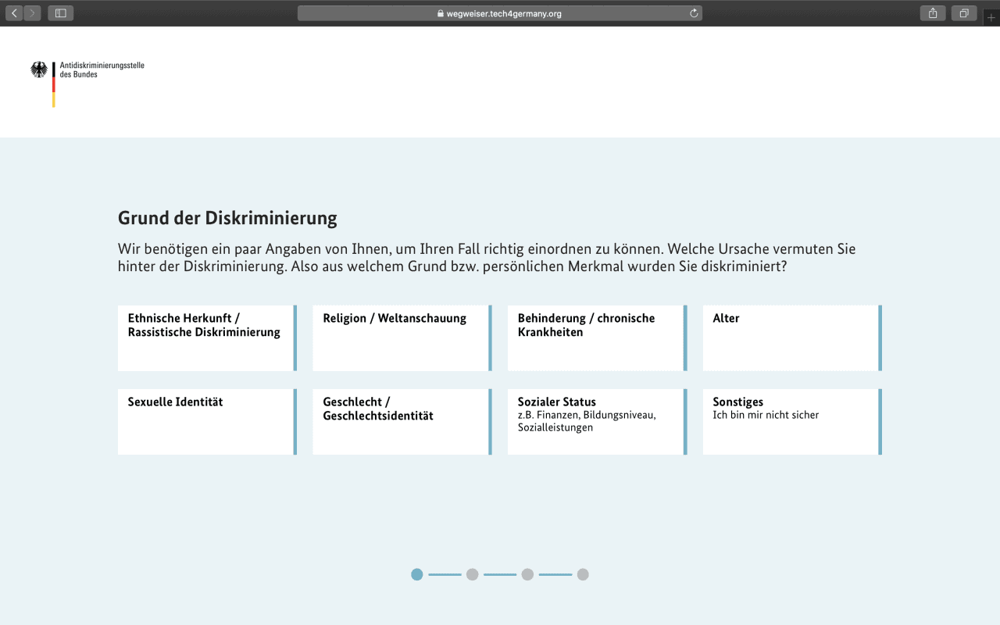
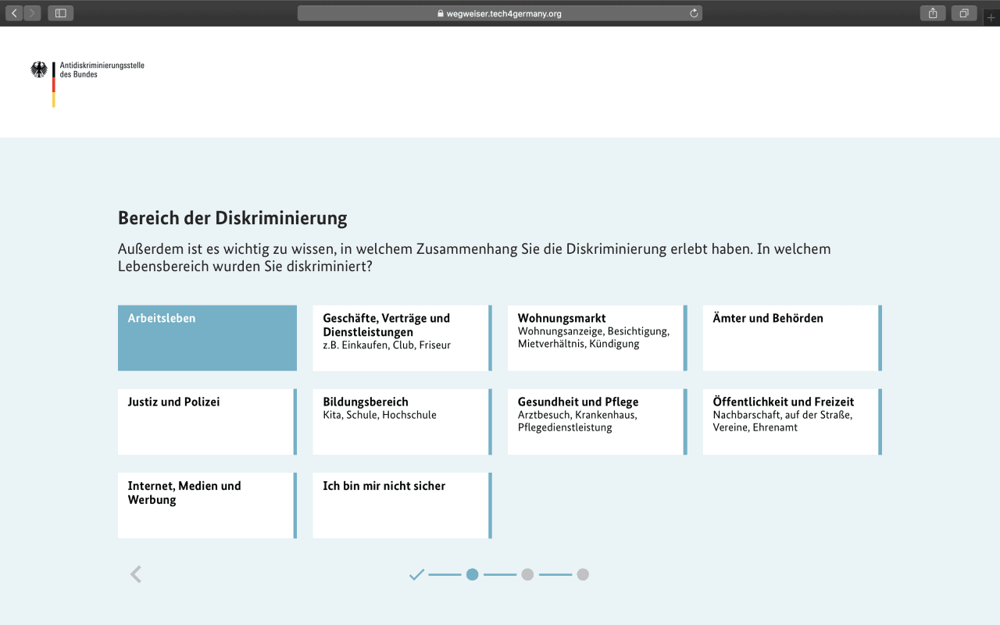
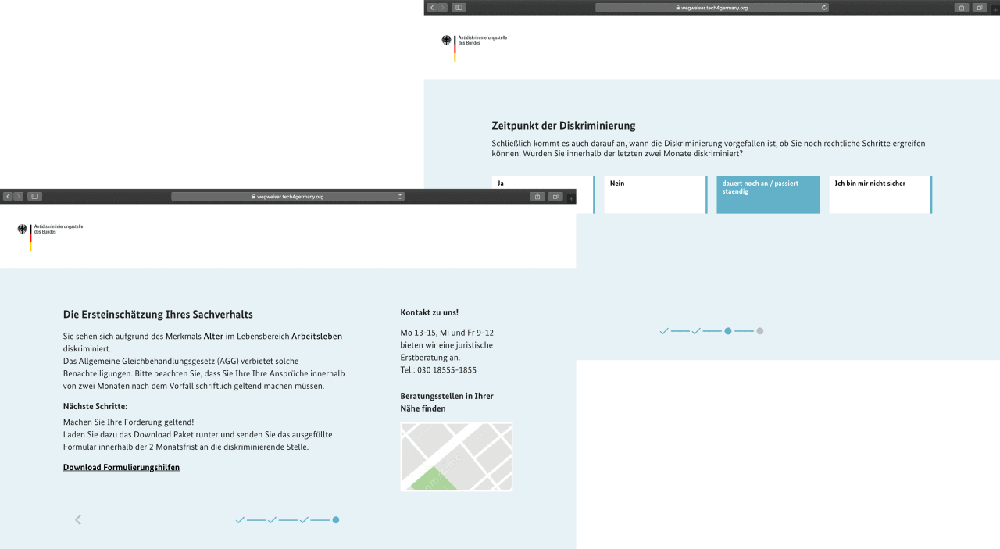
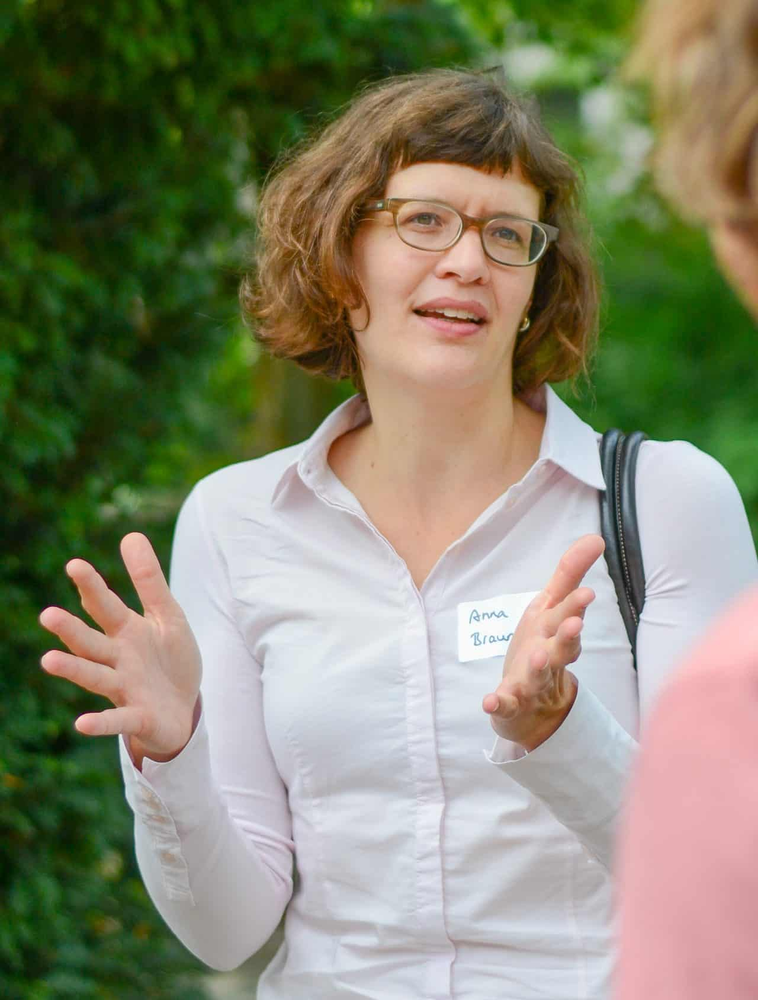

# Projekt Antidiskriminierung Antidiskriminierungsstelle 2020

# Antidiskriminierung

Die Antidiskriminierungsstelle des Bundes berät Ratsuchende, die einen Diskriminierungs-fall erlebt haben und spielt eine zentrale Rolle in der Arbeit gegen Diskriminierung. Seit Jahren steigen die Fallzahlen an. Für das kleine Team der Berater:innen, die über hohe juristische Fachkompetenzen verfügen, bedeutet das eine hohe Arbeitslast. Auf der Seite der Ratsuchenden herrscht gleichzeitig Verwirrung und Frustration. Sie sehen sich mit langen Wartezeiten konfrontiert, können Informationen schwer auffinden und oft ist ihnen nicht klar, was sie erwarten können. Das Ziel des Projektes ist es, einen Zugang zu schaffen, der die momentane Situation auf beiden Seiten verbessert.

#### [Fallstudie (PDF)](f1_Fallstudie_Antidiskriminierung_final-1.pdf)

# +++ Wegweiser live +++

Nach der Prototypisierung des Wegweisers während des Tech4Germany Fellowships wurden drei der Fellows im Anschluss als Freelancer:innen von der Antidiskriminierungsstelle mit der Umsetzung beauftragt. Der Wegweiser steht seit Juni 2021 auf der Website der ADS zur Verfügung. 

#### [Jetzt durchklicken](https://www.antidiskriminierungsstelle.de/DE/wir-beraten-sie/wegweiser-durch-die-beratung/wegweiser-node.html) 

# Hintergrund & Herausforderung

Die Antidiskriminierungsstelle des Bundes, kurz ADS, unterstützt und berät Ratsuchende, die einen Diskriminierungsfall erlebt haben und spielt eine zentrale Rolle in der Arbeit gegen Diskriminierung. Seit Jahren steigen die Fallzahlen an. Für das kleine Team der Berater:innen, die über hohe juristische Fachkompetenzen verfügen, bedeutet das eine hohe Arbeitslast. Viele Beratungsanfragen sind bei der ADS eigentlich nicht an der richtigen Stelle, sondern müssen weiterverwiesen werden. Des Weiteren ist die Arbeit oft repetitiv und wird manuell erledigt. Das nimmt zusätzlich viel Zeit in Anspruch. Aus diesen Gründen wurde sogar von Kampagnen abgesehen. Auf der Seite der Ratsuchenden herrscht gleichzeitig Verwirrung und Frustration. Sie sehen sich mit lange Wartezeiten konfrontiert, können Informationen schwer auffinden und oft ist ihnen nicht klar, was sie erwarten können. Das Ziel des Projektes ist es, in die Mitte zu treffen und einen Zugang zu schaffen, der die momentane Situation auf beiden Seiten verbessert.

# Ressourcen

#### [GitHub (Code) ](https://github.com/tech4germany/ads-prototype)

#### [Fallstudie (PDF)](f1_Fallstudie_Antidiskriminierung_final-1.pdf)

#### [Dokumentation (PDF)](f2_Projektdokumentation_Antidiskriminierung.pdf)

#### [User Journey (PDF)](f3_1b_ADS-Digital-Whiteboard-User-Journey-Ratsuchende.pdf)

# LINKS

#### [Prototyp](https://wegweiser.tech4germany.org/)

#### [Zwischenprototypen](https://antidiskriminierung.invisionapp.com/console/Prototypen_ADS-cke9r5lic00ky01x2cnw20pq5/cke9ruyxt003d01v01yqhaupj/play)

#### [Prototyp Pfadtest](https://xd.adobe.com/view/d65206cf-6cb6-43ad-8477-d56748e00af2-8301/screen/7b8c93d5-0090-4cb2-9fa8-7d3accc5a147/?fullscreen&hints=off)

#### [Prototyp Usertest](https://xd.adobe.com/view/2e7ec35f-54e7-4b91-9ed1-1b5245b5e121-7b2d/?fullscreen&hints=off)

#### [Twitter-Video](https://twitter.com/Tech4Germany/status/1295985449375334400)

#### [Pressemitteilung](https://www.antidiskriminierungsstelle.de/SharedDocs/Kurzmeldungen/DE/2020/nl_02_2020/nl_02_aus_der_arbeit_3.html)

# Zielsetzung & Vorgehen

Unsere Herausforderung war: Wie können wir den Zugang so gewährleisten, dass die Hilfesuchenden möglichst schnell passende Hilfestellungen für ihr Anliegen bekommen und die Berater:innen ihr Know-How an den richtigen Stellen einsetzen können? 

In 12 Projektwochen wurde unter Verwendung agiler Arbeitsmethoden, ergebnisoffen an dem Thema gearbeitet. Der Prozess wurde stets durch Nutzerbedürfnisse geleitet. Nach der Analysephase wurden die Problemfelder konsolidiert und anschließend wurde die Lösung iterativ entwickelt. Ziel war es, den betroffenen Bürger:innen möglichst viel Hilfe anzubieten. Daher erarbeitete das Team mit ihnen gemeinsam im user-zentrierten Designprozess ihre Bedürfnisse heraus.

# Erkentnisse & Lösung

Nach zahlreichen Testings, Feedback-Sessions und Ideenfindungsworkshops wurde der Wegweiser ins Leben gerufen.  Er ermöglicht es den Ratsuchenden über einen automatisierten Einstieg schnell an wichtige Informationen und Handlungsempfehlungen zu kommen. Zu der Vision gehört es ebenfalls, dass die Berater:innen der ADS damit entlastet werden und somit ihre Kernkompetenzen punktueller und effizienter einsetzen können. Der Wegweiser führt die Ratsuchenden durch eine kurze Reihe an Fragen, um einzuschätzen, wie der Fall am besten eingeordnet wird. Aktuell werden drei Kategorien abgefragt.  Das Merkmal, der Lebensbereich und das Datum der Diskriminierung. Nach Beantwortung der Fragen, erhält der/die Ratsuchende eine erste Handlungsempfehlung. Durch den Wegweiser verbessert sich die Effizienz bei Verweisfällen, gibt den Ratsuchenden mit wenigen Klicks eine erste Einschätzung und ermöglicht eine übersichtlichere Beratungsstellensuche. Die Ratsuchenden bekommen ebenfalls direkte Handlungsanweisungen und Werkzeuge zum Selbsthandeln.

## Einstieg

Ziel war es die Ratsuchenden nicht zusätzlich mit juristischen Fachausdrücken und komplexen Anwendungen zu verunsichern.

Deshalb ist der Einstieg intuitiv, niedrigschwellig und fragt zuerst nur den Merkmalsbereich der Diskriminierung ab.

## Nächste Schritte

Nacheinander werden Lebensbereiche und Zeitraum der Diskriminierung abgefragt.

Nach fünf Klicks erhalten Ratsuchende passende Informationen zu Ihrem Diskriminierungsfall.

# KEY INSIGHTS / ZENTRALE ERKENNTNISSE

## 1 Schatzkarte

Die Verwaltung hat eigentlich einen wahren Schatz an Wissen und Informationen aber die Wege dahin sind zu kompliziert. Der Zugang ist erschwert, weshalb die Bürger:innen nicht die notwendigen Informationen finden können.

Daher brauchen wir einfach funktionierende Wegweiser – sozusagen als Schatzkarte – um Hilfesuchende Bürger:innen digital an die Hand zu nehmen und zum Ziel zu führen!

## 2 Zugang zu Fachkompetenzen

Der Wegweiser ersetzt nicht die Beratungsleistung der Berater:innen der Antidiskriminierungsstelle. Er übersetzt den Teil der juristischen Einschätzung, der einer umfangreichen Beratung vorgelagert ist, in eine digitale Lösung. Ratsuchende erhalten damit Informationen zu ihrem Diskriminierungsfall und eine Grundlage, auf deren sie nächste Schritte wie beispielsweise eine Kontaktaufnahme einleiten können.

## 3 Nutzerzentrierung

Komplizierte Zusammenhänge und komplexe Inhalte müssen intuitiv und niedrigschwellig mit wenigen Klicks erreichbar aufbereitet werden. Der Nutzer muss im Zentrum der Entwicklung stehen. 

## 4 Diskriminierung

Viele Menschen machen Diskriminierungs-erfahrung und Diskriminierungen kommen öfter vor als man denkt. Die meisten Menschen unternehmen nichts dagegen und wissen nicht wie sie sich am besten wehren können. Jeder sollte die Möglichkeit erhalten sich über seine Rechte zu informieren und der Zugang sollte für alle Menschen gewährleistet sein.

## 5 Vision

Unsere Lösung ermöglicht es den Ratsuchenden über einen automatisierten Einstieg schnell an wichtige Informationen und Handlungs-empfehlungen zu kommen. Zu der Vision gehört es ebenfalls, dass die Berater:innen der ADS damit entlastet werden und somit ihre Kern-kompetenzen punktueller und effizienter einsetzen können. 

# Unsere Ergebnisse sind frei verfügbar

## Dokumentation

Detailliertes Vorgehen und Ergebnisse des Projektteams

#### [Download](f2_Projektdokumentation_Antidiskriminierung.pdf) 

## Prototyp

Funktionierender Prototyp unseres Antidiskriminierungs-wegweisers

#### [Link](http://wegweiser.tech4germany.org) 

## Code

Unsere Arbeitsergebnisse zum Wiederverwenden auf GitHub

#### [Link](https://github.com/tech4germany/ads-prototype) 

# das Team

**Jingyi Lisa Zhang** \
Product Fellow

**Neslihan Kilic** \
UI/UX Design Fellow

**Steffi Güthling** \
UI/UX Design Fellow

**Ben Gläser** \
Engineering Fellow

# Projektpartner

**Antidiskriminierungsstelle des Bundes**

**Bundesministerium für Familie, Senioren, Frauen und Jugend**

 \
**Daniel Scherr** \
Digitallotse

 \
**Dr. Anna Braunroth** \
Projektleiterin
