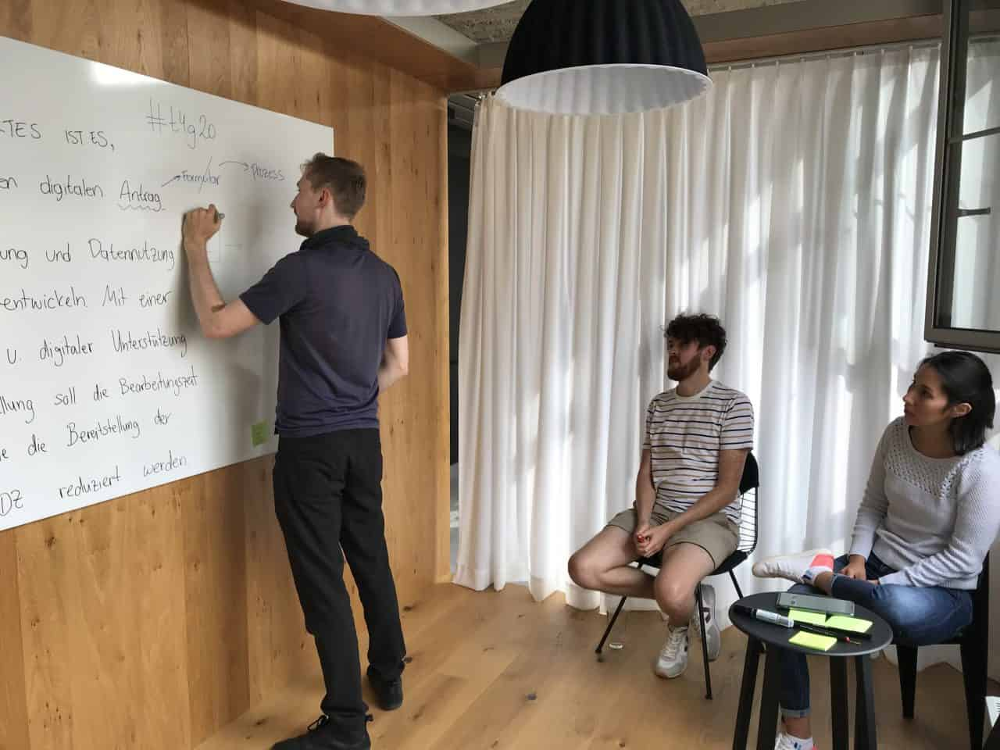
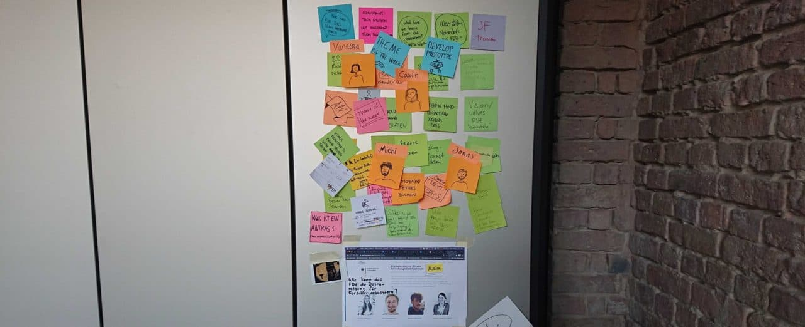
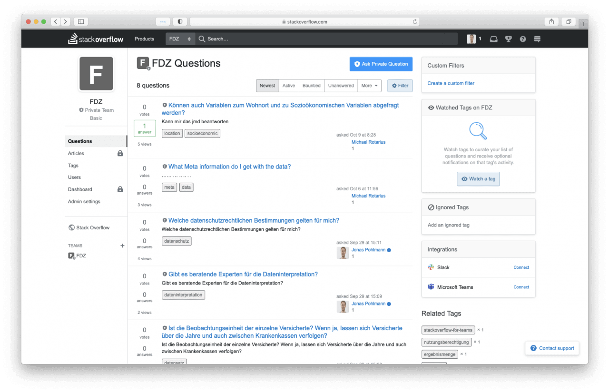
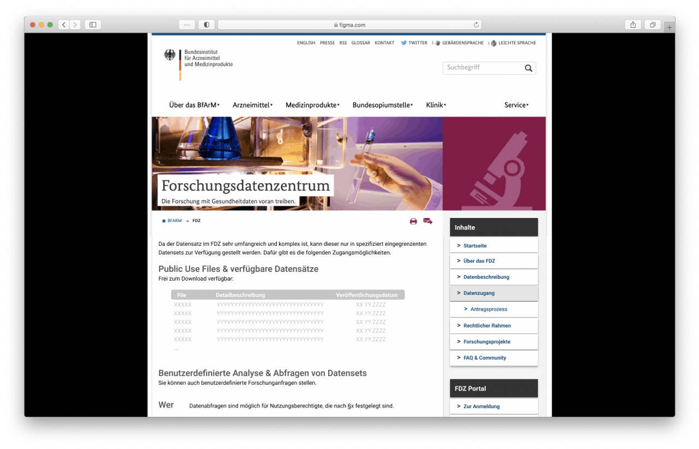
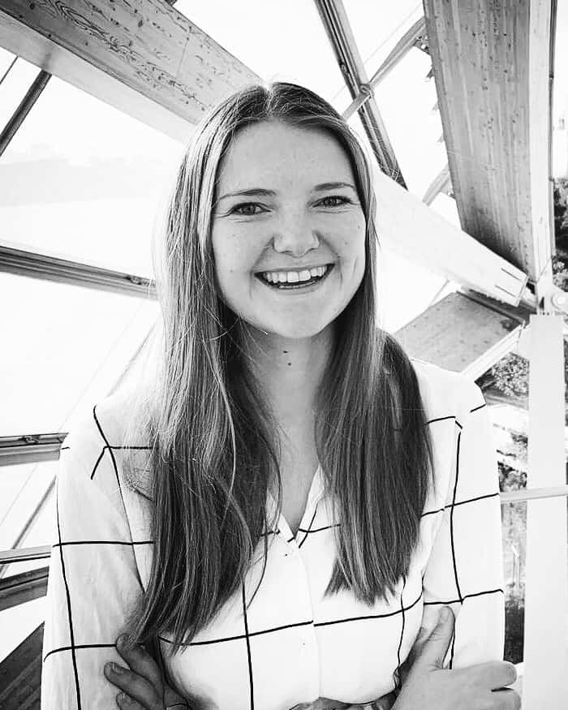
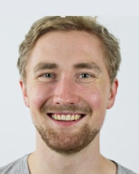
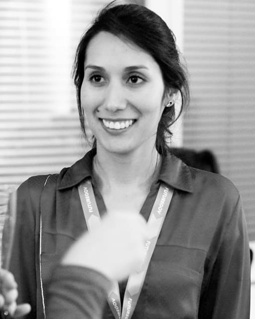

# **Forschungsdaten BMG 2020**

Im Forschungsdatenzentrum werden in einem geschützten Rahmen die Gesundheitsdaten von Krankenkassen für Forschungszwecke verfügbar gemacht. Tech4Germany hatte das Ziel, die Gesundheitsdaten besser zugänglich für Forscher:innen zu machen. Dafür wurde ein Prototyp für das neue Portal im Forschungsdatenzentrum unter Einbindung der Forscher:innen entwickelt. Somit wurde die Prozessführung für Forscher:innen wesentlich verbessert und so der Forschungsprozess transparent gemacht. 

### [Fallstudie (PDF)](f1_Fallstudie_FDZ.pdf)

# Hintergrund & Herausforderung

Die Vernetzung und Auswertung von Gesundheitsdaten hat insbesondere in der COVID Krise an Priorität gewonnen. Um die Forschung mit Gesundheitsdaten zum Wohle der Gesellschaft schneller voranzubringen, werden im Forschungsdatenzentrum (FDZ) Gesundheitsdaten der gesetzlichen Krankenkassen gesammelt. Nutzungsberechtigte, u.a. Forscher:innen und Forschungseinrichtungen, können für definierte Auswertungszwecke Daten anfragen. Bedingt durch ein sehr kleines Team und eine hohe Anzahl an Forschungsanfragen, hat die Bearbeitung der Anfragen sich über große Zeiträume erstreckt. Von einer Antragsstellung bis zum Erhalt der relevanten Forschungsdaten vergingen bisher oft viele Monate bis über ein Jahr. 

Das BMG hat mit dem BfArM Tech4Germany in das FDZ geholt, um die Nutzungsfreundlichkeit für die Forscher:innen zu verbessern.

# Ressourcen

### [Benchmarking (PDF)](f2_Benchmarking-Forschungsdatenzentrum.pdf)

### [Fallstudie (PDF)](f1_Fallstudie_FDZ.pdf)

### [GitHub (Code)](https://github.com/tech4germany/fdz-portal) 

# LINKS

### [Antragsportal Prototyp](https://fdz.tech4germany.org/)

### [Landingpage Prototyp](https://www.figma.com/proto/FCtbGdUX5YFNlNisle6qhZ/%F0%9F%A4%96-FDZ-Landing-Page?node-id=129%3A1&scaling=min-zoom)

# Zielsetzung & Vorgehen

Das Ziel war, die Datennutzung für Forscher:innen zu erleichtern. Dabei sollten im Zentrum die Forscher:innen als Nutzer:innen stehen. Zunächst wurden zahlreiche Interviews mit Forscher:innen geführt, um ergebnisoffen ihre Probleme zu verstehen. Neben der Dauer des Prozesses wurde vor allem die Intransparenz des Bearbeitungsprozesses als Hindernis für eine gute Planbarkeit der Forschungsvorhaben genannt.

Zudem war es herausfordernd für Forscher:innen, sich die notwendige Expertise für den Umgang mit dem komplexen Datensatz anzueignen. \
Mit einem verbesserten Verständnis von Problemen der Forscher:innen konnten Ideen entwickelt und wiederum iterativ mit ihnen in etlichen Tests verbessert werden. Dabei wurde interdisziplinär das Expertenwissen der Digitallotsen, also den Repräsentant:innen aus den Behörden, mit den Fähigkeiten der Fellows in Produktmanagement, Design und Coding kombiniert, um den Forscher:innen eine gute Lösung zu bieten. 

# Erkentnisse & Lösung

Zu den Bedürfnissen der Forscher:innen gehört ein hohes Maß an Planbarkeit ihrer Forschungsprojekte. Sie wollen Transparenz über den Prozess im FDZ sowie viele Informationen, um vorab schnellstmöglich zu entscheiden, ob die FDZ-Daten für ihre Forschung geeignet sind. Dafür haben wir einen dreiteiligen Prototypen entwickelt, um eine digitale Führung der Forscher:innen durch den Antragsprozess zu ermöglichen.

Erstens wurde die öffentliche Landingpage mit Hilfe zahlreicher Nutzer:innentests restrukturiert, um relevante Informationen gezielt für die verschiedene Forscher:innen bereitzustellen. Während einige durchaus viel Erfahrung mit der Forschung mit Gesundheitsdaten von Krankenkassen haben, hat die Mehrheit der Forscher:innen bisher mit weit weniger komplexen Daten gearbeitet. Um die dafür notwendige Expertise zu vermitteln, haben wir zweitens Ansätze für eine Forschungscommunity vertestet. Dort können sich Forscher:innen untereinander vernetzen und unterstützen, sodass gleichzeitig Kapazitäten im FDZ geschont werden. Drittens haben wir eine Status Page für das neue Portal entworfen, in dem der Bearbeitungsstatus einzusehen ist. 

# Antragsportal

Im neuen Antragsportal können Forscher:innen übersichtlich die Historie, den aktuellen Stand, sowie einzureichende Unterlagen einsehen.

Der gesamte Forschungsprozess mit dem FDZ wird so transparenter. Zudem können Forscher:innen ihre Forschungsvorhaben jetzt besser planen.

# Community

Um die Transparenz für Forscher zu erhöhen haben wir erforscht, wie man eine Community für Forscher gestalten müsste.

Ziel hierbei war es herauszufinden, wie Forscher sich vernetzen und unterstützen können, als auch die Arbeitsbelastung für das Forschungsdatenzentrum zu senken.

# Landingpage

Die öffentliche Landingpage wurde restrukturiert, um relevante Informationen gezielt für die Forscher:innen mit unterschiedlichem Vorwissen bereitzustellen.

Es gibt jetzt klare Informationen über die verschiedenen Wege, um an Daten für Forschungszwecke zu gelangen.

# Unsere Ergebnisse sind frei verfügbar

## Benchmarking

Ein Vergleich mit anderen Forschungsdatenzentren in der EU

### [Lesen](f2_Benchmarking-Forschungsdatenzentrum.pdf) 

## Prototyp

Der von unserem Team entwickelte Prototyp für das Antragsportal

### [Besuchen](https://fdz.tech4germany.org/) 

## Code

Der Open Source Code unseres Prototypens

### [Github](https://github.com/tech4germany/fdz-portal) 

# Das Team

 \
**Carolin Bednarz** \
Product Fellow

 \
**Jonas Pohlmann** \
Product Fellow

 \
**Michael Rotarius** \
Engineering Fellow

 \
**Vanessa Robayo Ladino** \
Design Fellow

### Projektpartner:innen

**Bundesministerium für Gesundheit**

**Bundesinstitut für Arzneimittel und Medizinprodukte**

**Dr. Silke Maas** \
Digitallotsin

**Dr. Jochen Dreß** \
Digitallotse

**Dr. Steffen Heß** \
Digitallotse

**Dirk Hellthaler** \
Digitallotse

**Jan Franzen** \
Digitallotse
