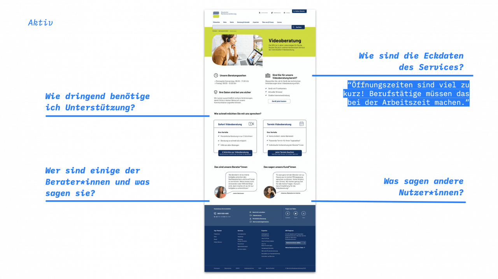
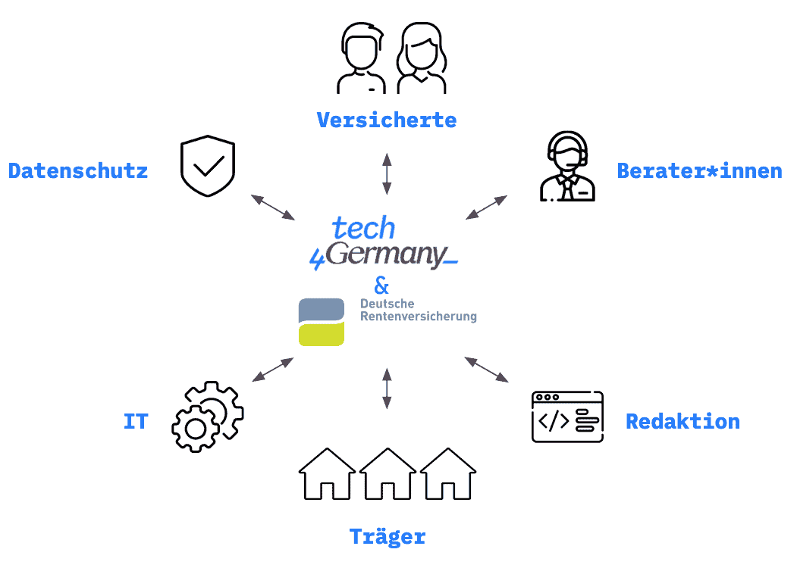
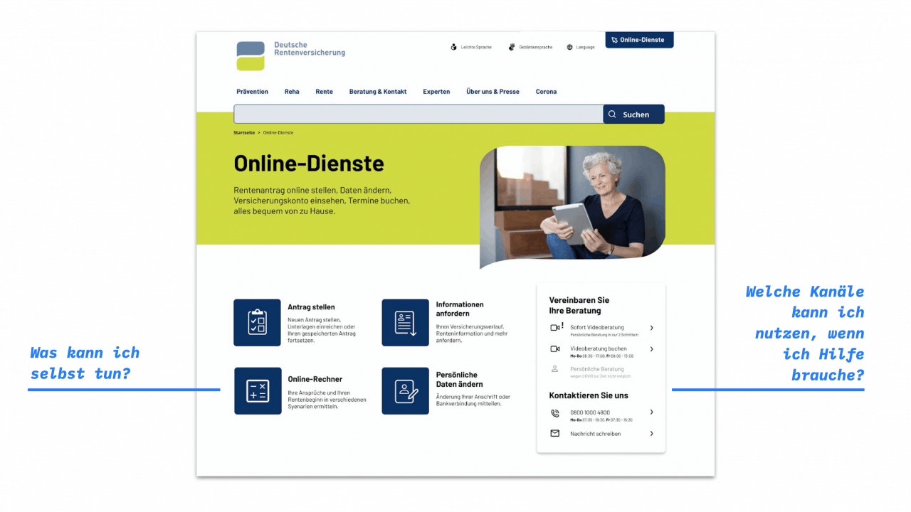
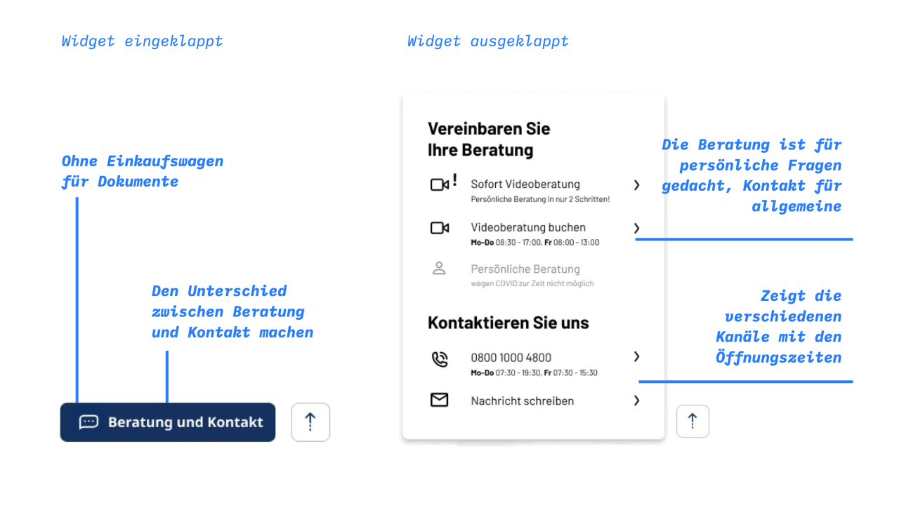
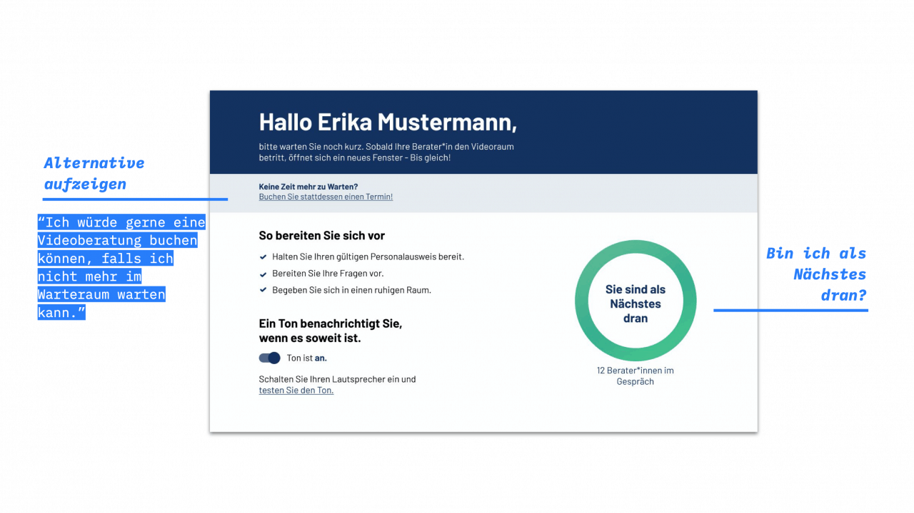

# **Online-Videoberatung DRV 2020**

Zusammen mit der Deutschen Rentenversicherung haben wir am Thema Videoberatung gearbeitet. Bei ca. 80 Millionen Kund:innen gibt es eine Menge zu beachten.

### [Prototyp ausprobieren](https://www.figma.com/proto/RKOGPPatPQ1HGUdYwo3Ynw/T4G_Rentify?node-id=1133%3A696&viewport=1533%2C-185%2C0.05017091706395149&scaling=scale-down-width&hide-ui=1)

# Hintergrund & Herausforderung

Die Deutsche Rentenversicherung (DRV) betreut ca. 80 Mio. Versicherte und Rentner:innen. Alle kommen im Laufe ihres Lebens mit der DRV in Kontakt. Die bürokratische Sprache in Briefen sorgt häufig für Unsicherheit und Nachfragen. In über 10.000 Kundenkontakten pro Arbeitstag werden diese Fragen und andere Anliegen persönlich und individuell beantwortet. Lange Anfahrtswege, zeitliche Einschränkungen, körperliche Einschränkungen und nicht zuletzt Corona machen dies jedoch für viele Menschen unmöglich. Das Pilotprojekt Videoberatung ermöglicht heute schon einigen Kund:innen sich eine persönliche Beratung in ihr Wohnzimmer zu holen. Erste Erkenntnisse weisen aber noch unterschiedliche Einstiegshürden auf. So gibt es wegen des Pilotprojekts etwa regionale Einschränkungen und die reservierte Gesprächszeit wird oft nicht ausgenutzt. Im Rahmen von Tech4Germany soll das neue Angebot Sofort-Videoberatung für einen bundesweiten Roll-Out innerhalb der [Online-Dienste](https://www.deutsche-rentenversicherung.de/DRV/DE/Online-Dienste/online-dienste_node.html) der DRV entwickelt werden. 

Einblick in unsere Ergebnisse: Die Landingpage der beiden Services Videoberatung mit Termin und Sofort Videoberatung. In unserer Dokumentation haben wir die Ansichten des Prototypen mit Erkenntnissen und Zitaten aus den User-Interviews und User-Tests kombiniert.

# Ressourcen

### [Prototyp (Figma)](https://www.figma.com/proto/RKOGPPatPQ1HGUdYwo3Ynw/T4G_Rentify?node-id=1133%3A696&viewport=1533%2C-185%2C0.05017091706395149&scaling=scale-down-width&hide-ui=1)

### [Prototyp (InVision)](https://inken764402.invisionapp.com/overview/Rentify-ckg93au1w0bp901c92kiodieu/screens)

### [Fallstudie (PDF)](f1_Fallstudie-Videoberatung.pdf)

# Zielsetzung & Vorgehen

Grundlage für unsere Arbeit bildete ein an den Double-Diamond angelehnter Projektplan. Im Zentrum stand die Frage, wie wir Kund:innen so schnell wie möglich persönlich weiterhelfen können. Diese Zielsetzung erarbeiteten wir zusammen mit unseren Digitallotsinnen auf Basis unserer Erkenntnisse aus zahlreichen Interviews mit Kund:innen und Berater:innen sowie dem Evaluationsbericht des Pilotprojektes. Im gesamten Prozess beteiligten wir darüber hinaus auch weitere Stakeholder wie fachlich Verantwortliche für die Anwendung zur Terminbuchung, die Online-Redaktion, Entwickler:innen, externe Dienstleister sowie Arbeitsgruppen. Dies war notwendig, da sich das Angebot Videoberatung über viele verschiedene Verantwortungsbereiche erstreckt. In der Lösungs-Phase haben wir schließlich einen interaktiven Prototypen erstellt. Diesen haben wir mithilfe der Erkenntnisse aus unseren Tests mit 16 Kund:innen und Berater:innen in 9 Iterationen verbessert.

# Erkenntnisse & Lösung

Die Erfahrung persönlicher Beratung wird nach wie vor sehr hoch geschätzt. Hier bietet besonders der Service Videoberatung einen Mehrwert für Kund:innen, da er von überall aus genutzt werden kann. Im Rahmen des Pilotprojektes wurden jedoch neben technischen Problemen auf Seiten der Kund:innen (Kamera/Mikro bei 50% der Beratungen nicht nutzbar) auch inhaltliche Probleme sichtbar. So waren etwa die gesetzlichen Regelungen in Briefen für Kund:innen oft nicht verständlich. Dies führt zu dem Bedürfnis nach kurzen Beratungsgesprächen, in denen Sachverhalte geklärt und nächste Schritte erläutert werden. Hierfür fehlt jedoch die Flexibilität bei Terminen. Die im Pilotprojekt festgelegte Dauer von 60 Minuten schreckte Kund:innen oft ab, durchschnittlich wurden jedoch nur 39 Minuten genutzt. Um diese Herausforderungen gemeinsam zu lösen, entwickelten wir die Sofort-Videoberatung. Hier können Kund:innen persönlich, individuell und vor allem spontan beraten werden. Die Zugehörigkeit zu Trägern entscheidet im Pilotprojekt noch über die Verfügbarkeit der Videoberatung. Ein trägerübergreifender Pool mit Berater:innen würde mehr Kund:innen den Zugang ermöglichen. Ein solches Netzwerk kann auch auf schwankende Nachfrage reagieren und die oft komplexen Sachverhalte lösen.

## Online-Dienste als Einstieg

In unseren Interviews und Tests fanden wir heraus, dass Kund:innen hier besonders häufig die Videoberatung vermuteten.

## Globales Widget für Beratung & Kontakt

Das bereits bestehende Widget für Kontakt kann auch um die Videoberatung erweitert werden. So gibt es einen globalen, konsistenten Einstiegspunkt in die Services.

# Unsere Strategie

Im Fokus unseres Projektes stand die folgende Frage: 

„Wie können wir Kund:innen so schnell wie möglich und persönlich weiterhelfen?“

Doch wie gelangen wir als Team dorthin? Wie gestalten wir einen Service, der sich in das bestehende Angebotskonzept eingliedert und eine positive Erfahrung für die Kund:innen darstellt? 

Um diese Fragen strukturiert zu beantworten, erstellten wir eine Strategie, welche im Laufe der Iterationen weiter angepasst und verfeinert wurde. Sie sollte uns dabei helfen, mit einem Teilprodukt zu beginnen und dieses nutzer:innenzentriert und iterativ auszubauen. Dabei beantwortet sie außerdem die Frage, wie Kund:innen die Videoberatung auffinden würden und analysiert u.a. zwei Einstiegspunkte in den Service auf der Website der DRV.

## 1 Terminbuchung

Wir verbessern u. a. die visuelle Hierarchie der Informationen, um eine intuitive Navigation zu ermöglichen und sicherzustellen, dass die Kund:innen zur richtigen Zeit die richtigen Informationen erhalten. Zusätzlich soll das Konzept trägerübergreifend skaliert werden können, da Videoberatung aus Kund:innensicht ortsunabhängig ist. 

## 2 Sofort Videoberatung

Die Videoberatung mit Termin soll um den Service der Sofort Videoberatung ergänzt werden und somit neue Anwendungsfälle bedienen. Bei dringenden Fragen können schnell Antworten erhalten werden, ohne etwa eine volle Stunde für einen Termin buchen zu müssen. Sofort Videoberatung als Service-Hypothese soll als Prototyp nutzerzentriert gestaltet sowie vertestet werden, um herauszufinden, ob er zusätzlichen Mehrwert für Kund:innen bietet.

## 3 Verortung der Videoberatung

Wie gehen Kund:innen vor, um den Service der Videoberatung auf der Website der DRV zu finden? Wir analysieren Wege innerhalb der Online-Dienste sowie der globalen DRV-Website und verorten ihn dort, wo Kund:innen ihn erwarten würden. So wird die Videoberatung schlussendlich dort gefunden, wo Kund:innen das entsprechende Bedürfnis haben. 

# Das Team

 \
**Vanessa Espinosa \
**Design Fellow \
[LinkedIn](https://www.linkedin.com/in/espinosaureta/)

 \
**Inken Alber \
**Design Fellow \
[LinkedIn](https://www.linkedin.com/in/inken-alber)

 \
**Leonhard Melzer \
**Engineering Fellow \
[LinkedIn](https://www.linkedin.com/in/leonhardmelzer/) 

 \
**Julian Wildmann \
**Product Fellow \
[LinkedIn](https://www.linkedin.com/in/julian-wildmann/)

# Projektpartner:innen

Deutsche Rentenversicherung
