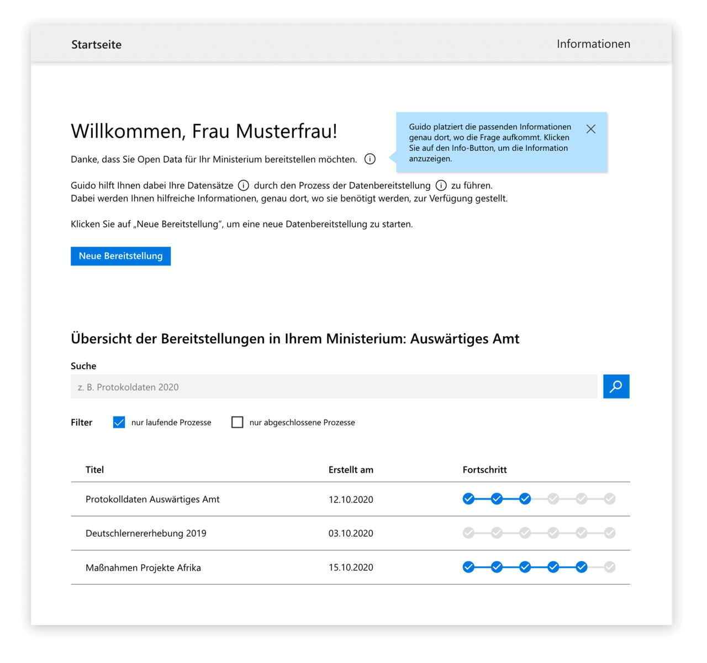
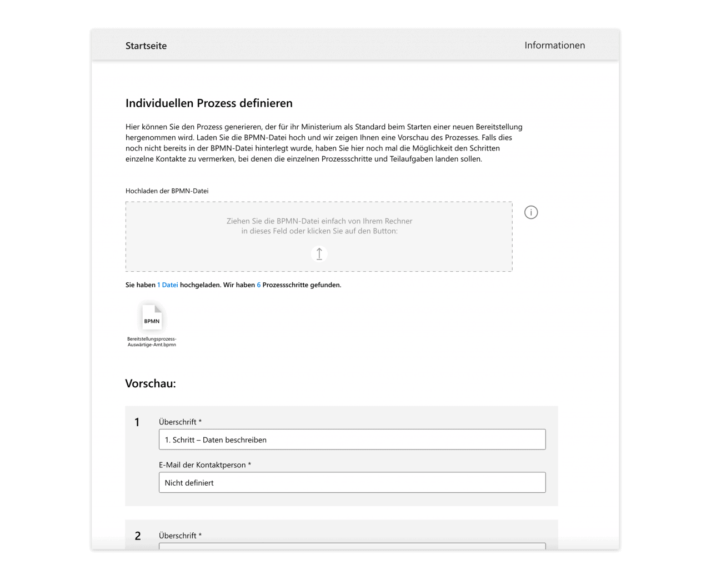
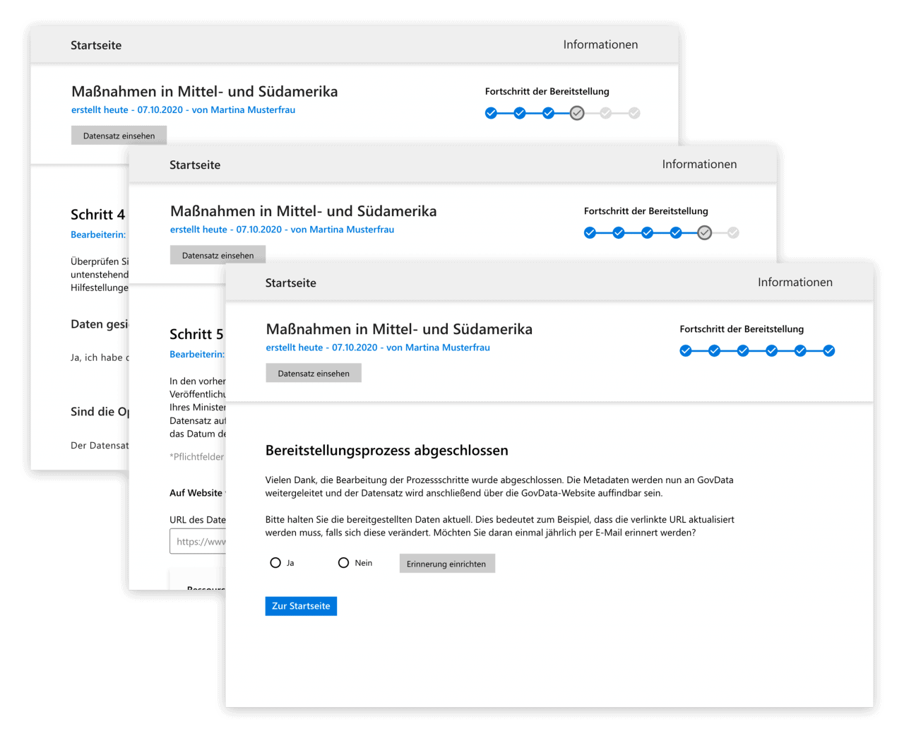

# **Open Data Portal AA Govdata 2020**

Die Verfügbarkeit von Daten ist Teil einer modernen Infrastruktur.  Wie kann die Plattform GovData für Datenanwender:innen und/oder Datenbereitsteller:innen nutzerfreundlicher gemacht werden?

# Hintergrund & Herausforderung

Das Prinzip der offenen Daten – “Open Data” – bekommt weltweit eine immer größere Bedeutung. Die Verfügbarkeit von Daten wird zunehmend zu einem wichtigen Wirtschaftsfaktor und die Daten zu einem Teil einer modernen Infrastruktur. Damit die von Bund-, Länder- und Kommunalverwaltungen bereitgestellten Open Data einfach auffindbar sind, wurde das bundesweite Metadatenportal GovData geschaffen. Trotz des Anspruchs der Bundesregierung ein Vorreiter im Bereich Open Data zu sein, landete Deutschland im EU Open Data Maturity Report 2019 lediglich auf Platz 12 unter den 28 EU Staaten. Sowohl die Nutzerfreundlichkeit der Plattform, als auch der Prozess der Datenbereitstellung für Ministeriumsmitarbeiter:innen bieten dabei Potenzial zur Verbesserung. Vor diesem Hintergrund war die Fragestellung für das T4G-Fellowship – wie kann die Plattform GovData für Datenanwender:innen und / oder Datenbereitsteller:innen nutzerfreundlicher gemacht werden?

### [Video](v1_GuidoErklaervideo_OpenDataPortal.mp4)

# Ressourcen

### [Fallstudie (PDF)](f1_Fallstudie_OpenDataPortal.pdf)

### [GitHub (Code)](https://github.com/tech4germany/open-data-process-guide)

### [Dokumentation (PDF)](f2_Projektdokumentation_OpenDataPortal.pdf)

### [Umsetzungsplan (PDF)](f3_Umsetzungsplan_OpenDataPortal.pdf)

### [Abschlusspitch (Video)](https://youtu.be/UzrPXo_7ht0)

# Zielsetzung & Vorgehen

Da es sich um eine sehr offene Fragestellung handelt, wurden insbesondere in den ersten Wochen eine Vielzahl an Interviews mit verschiedensten Stakeholdern (Anwender:innen, Open Data Expert:innen, Verwaltungsmitarbeiter:innen, etc.) geführt, um ein breites Problemverständnis zu erlangen. Gemeinsam mit den Projektpartnern wurden die identifizierten Probleme kategorisiert und bewertet. Es wurde beschlossen,  sich auf den Prozess der Datenbereitstellung für Verwaltungsmitarbeiter:innen zu fokussieren, um sowohl die Qualität, als auch die Quantität der veröffentlichten Daten, insbesondere auf Bundesebene, zu erhöhen. Eine Vielzahl möglicher Lösungen wurde durch Kreativtechniken zunächst entwickelt und anschließend bewertet. Mittels kontinuierlicher Nutzertests hat das Team dann iterativ und nutzerzentriert eine Lösung vom einfachen Click-Dummy bis zum entwickelten MVP gebaut und umgesetzt.

# Erkenntnisse & Lösung

Trotz der Verabschiedung des Open-Data Gesetzes 2017, welches Behörden dazu verpflichtet auf Bundesebene offene Daten zur weiteren Verwendung zur Verfügung stellen, wurden bisher wenige Datensätze eingestellt. Der Prozess der Bereitstellung wird von Verwaltungsmitarbeiter:innen häufig als zu aufwendig wahrgenommen, ist nicht verstanden und Verantwortlichkeiten sind unklar. Vor diesem Hintergrund hat das Projektteam GUIDO in Form eines Sharepoint MVPs entwickelt. GUIDO ist ein Open Data Process Guide, der ministeriums-spezifisch angepasst werden kann und alle Schritte von der Auswahl der Daten, über die rechtliche Prüfung, die Veröffentlichung auf der Ministeriumswebsite und die Weitergabe der Metadaten auf GovData begleitet. Mitarbeiter:innen werden darüber hinaus entlang des Prozesses mit relevanten Informationen und Hilfestellungen unterstützt.

## Prozessdefinition

Um den unterschiedlichen Gegebenheiten in den Ministerien gerecht zu werden, ist ein zentrales Feature von GUIDO die Ausgestaltung des jeweils Ministeriums-spezifischen Open Data Bereitstellungsprozesses flexibel zu halten.

## Schritt für Schritt zum Ziel

GUIDO hilft Ministeriums-Mitarbeitenden Schritt für Schritt durch den Bereitstellungsprozess von Open Data. Falls einzelne Schritte die Aufmerksamkeit von anderen Stellen im Hause benötigen, können dieser zur Bearbeitung des jeweils passenden Schrittes eingeladen werden.

# Unsere Ergebnisse sind frei verfügbar

## Dokumentation

Detailliertes Vorgehen und Ergebnisse des Projektteams

### [Download](f2_Projektdokumentation_OpenDataPortal.pdf) 

## Code

Unsere Arbeitsergebnisse zum Wiederverwenden auf GitHub

### [GitHub (Code)](https://github.com/tech4germany/open-data-process-guide) 

# das Team

 \
**Nele Lüpkes** \
Design Fellow \
[LinkedIn](https://www.linkedin.com/in/nelel%C3%BCpkes/) 

 \
**Tjorven Rohwer** \
Product Fellow \
[LinkedIn](https://www.linkedin.com/in/tjorvenrohwer/)

 \
**Benjamin Degenhart** \
Engineering Fellow \
[LinkedIn](https://www.linkedin.com/in/bdegenhart/)

 \
**Daniela Vogel** \
Design Fellow \
[LinkedIn](https://www.linkedin.com/in/daniela-vogel-9831b7183/)

# Projektpartner

 \
**Jemila Kehinde \
**Digitallotsin

 \
**Jens Schüring \
**Digitallotse

 \
**Christian Horn \
**Digitallotse

 \
**Antje Göldner \
**Digitallotsin

 \
**Christian Wittig \
**Digitallotse
