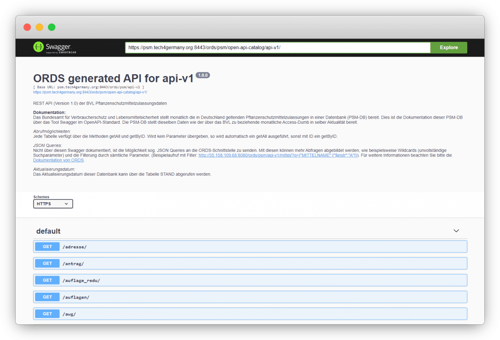

# **Pflanzenschutzmittel BMEL 2020**

Pflanzenschutzmittelzulassungsdaten werden bereits vom Bundesamt für Verbraucherschutz und Lebensmittelsicherheit zur Verfügung gestellt. Im Rahmen unseres Projektes haben wir den Prozess durch die Entwicklung einer API anwender:innenfreundlicher gestaltet.

### [Fallstudie (PDF)](f1_PSM_Fallstudie.pdf)

# +++ Schnittstelle seit August 2021 live +++

Nach der Prototypisierung durch Tech4Germany ist die Schnittstelle seit August 2021 live. 

### [Zur Schnittstelle](https://psm-api.bvl.bund.de/)

### [Zur Meldung des BVL](https://www.bvl.bund.de/SharedDocs/Fachmeldungen/04_pflanzenschutzmittel/2021/2021_08_16_Fa_Testphase_PSM_Zulassungsdaten_API.html) 

# Hintergrund & Herausforderung

Das Thema Datenbereitstellung durch die öffentliche Verwaltung ist innerhalb der Bundesregierung hoch angesiedelt. Für die Umsetzung einer zentralen Datenstrategie fehlt es jedoch vielen Ministerien und Behörden aktuell an Erfahrung im Umgang mit elektronischen Daten. Um diese Erfahrung auszubauen, wurde die Pflanzenschutzmitteldatenbank des Bundesamts für Verbraucherschutz und Lebensmittelsicherheit (BVL) für ein Pilotprojekt ausgewählt. Durch die Bereitstellung dieser Daten können komplette Ökosysteme von Landwirtschaft und Industrie, zu Bürger:innen, mit einer zentralen und rechtssicheren Datenquelle unterstützt werden. Die Daten des BVL werden bereits in digitaler Form zur Verfügung gestellt. Da Anwender:innen mit der Verarbeitung des aktuellen Stands der Daten vertraut sind, bestehen konkrete Vorstellungen, wo die Daten zusätzlichen Mehrwert liefern können.

# Ressourcen

### [Fallstudie (PDF)](f1_PSM_Fallstudie.pdf)

### [Doku (PDF)](f2_PSM_Projektdokumentation_final.pdf)

### [GitHub (Code)](https://github.com/tech4germany/psm.api.v1)

# Zielsetzung & Vorgehen

Die Vision des übergeordneten Bundesministeriums für Ernährung und Landwirtschaft (BMEL) für diese Datenbank ist eine API in einem offenen Standardformat, welche die Daten maschinenlesbar und durchsuchbar zur Verfügung stellt. Motivation des BMEL ist es, im Rahmen des Fellowships Erfahrungen zu sammeln, wie ein Weg dorthin aussehen kann. 

Wir führten Expert:inneninterviews, um den Weg zur Umsetzung dieser Vision zu ergründen.  Die an uns herangetragenen Probleme und Lösungsansätze konsolidierten wir in einem agilen, nutzer:innenzentrierten Vorgehen. Wir entschlossen uns dabei, den Datenbereitstellungsprozess zu fokussieren. Durch den Fokus auf eine Prozessverbesserung der Bereitstellung erwarten wir allen Anwender:innern gleichermaßen zu helfen. Wir gestalteten den Prozess sowohl innerhalb, als auch außerhalb der Behörde nutzer:innenfreundlicher. In folgenden Projekten können die Daten selbst, in ihrer Struktur und Maschinenlesbarkeit, verbessert werden.

## Interviews

## Synthese

## Ideen

## Prototyp

## Testen & Iterieren

# Erkentnisse & Lösung

Im Rahmen der Expert:inneninterviews mit Anwender:innen der Daten innerhalb und außerhalb des BVL, zeigte sich, dass der Bereitstellungsprozess für beide Seiten aufwändig ist. Aktuell werden die Daten monatlich manuell in einem proprietären Dateiformat verschickt.

Bereits durch die Bereitstellung der Daten in einem schlanken Prozess, jedoch in der gleichen Struktur, kann ein Schritt in die Richtung moderner Datenbereitstellung gegangen werden. Als konkrete Lösung entwickelten wir eine API, die mit möglichst wenig Aufwand in die bestehende Systemwelt des BVL integriert werden konnte. Zusätzlich konnten wir durch unseren Einblick Ideen für weitere Empfehlungen erarbeiten: zur Weiterentwicklung der Pflanzenschutzmittelschnittstelle und zur Entwicklung moderner Schnittstellen allgemein.

## API nach OpenAPI-Standard

Das technische Ergebnis unseres Projekts ist eine API nach OpenAPI-Standard, welche vorhandene Pflanzenschutzmitteldaten zur Verfügung stellt. Sie wurde in zwei agilen Iterationen mit Nutzer:innen getestet und weiterentwickelt. 

## Bereits im Testbetrieb im BVL

Die finale Version umfasst einen dokumentierten Endpunkt pro Tabelle der Pflanzenschutzmitteldatenbank. Die von uns entwickelte API wurde auf einem Testsystem des BVL installiert und soll in einem öffentlichen Testbetrieb zur Verfügung gestellt werden.

# das Team

 \
**Lara Albrecht \
**Product Fellow

 \
**Kai Bitterschulte \
**Engineering Fellow

 \
**Frederike Ramin \
**Engineering Fellow

 \
**David Redlich \
**Engineering Fellow

# Projektpartner

**Armin Weiser \
**Projektleiter

**Peter Ahlbrecht \
**Digitallotse

**Burkhard Golla** \
Digitallotse

**Alexander Pfaff** \
Digitallotse

**Armin Wiese** \
Digitallotse
