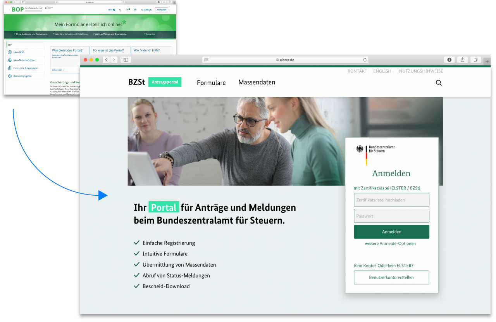
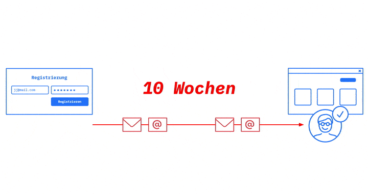
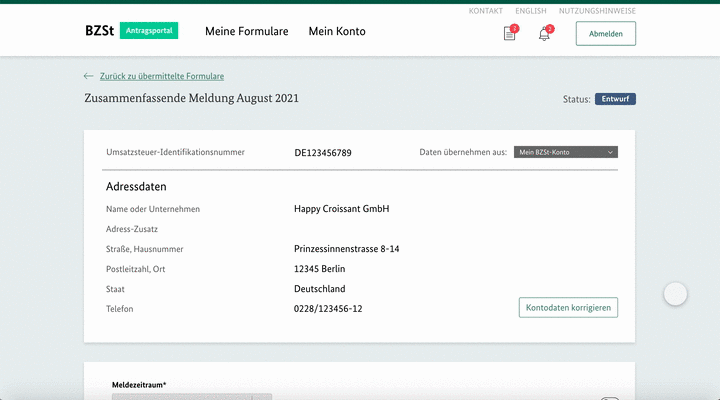
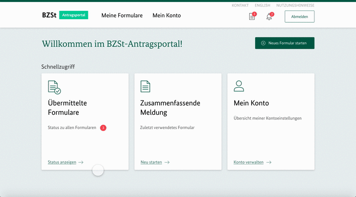
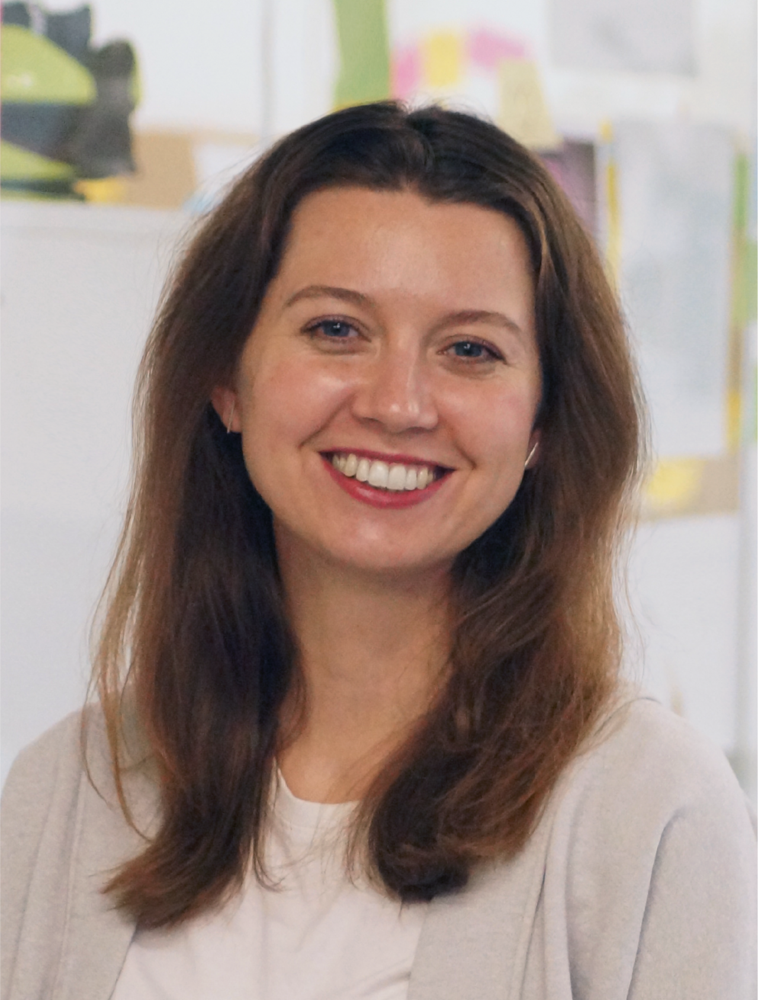

# Online Antragsportal Bundeszentralamt für Steuern 2021

# Digitales Antragsportal

Das Bundeszentralamt-für-Steuern-Online-Portal (BOP) ermöglicht die digitale Abgabe von Steueranträgen. Tech4Germany hatte das Ziel, das Portal einfacher zu gestalten. Mit dem entwickelten Prototypen können Nutzer:innen schneller Steuern abgeben und zurückerhalten. 

#### [Fallstudie (PDF)](https://tech.4germany.org/wp-content/uploads/2021/11/Fallstudie_BZSt.pdf)

# Hintergrund & Herausforderung

Im **BOP (BZSt-Online-Portal)** gehen jährlich rund 2.300.000 steuerliche Anträge und Meldungen an das BZSt (Bundeszentralamt für Steuern) ein. Die steuerpflichtigen Personen verstehen das Portal häufig nicht und stehen vor Fragen, mit denen sie die überlastete Hotline anrufen. Diese resultieren oft aus der momentan **schwer verständlichen Weboberfläche** des BOPs.

Das BZSt entwickelt das BOP in einer Kooperation mit dem ITZBund jetzt **komplett neu**, womit sie auch den Reifegrad 4 des OZG (Onlinezugangsgesetz) erreichen wollen. Diese Entwicklungsarbeit haben wir als Tech4Germany-Team unterstützt.

# Ressourcen

#### [Fallstudie (PDF)](f1_Fallstudie_BZSt.pdf)

#### [Empfehlungen (PDF)](f2_Handlungsempfehlungen.pdf)

#### [Dokumentation (PDF)](f3_BZSt-Projektdokumentation_compressed.pdf)

#### [Personas (PDF)](f4_BZSt_Personas.pdf)

# Prototypen

#### [Vollzugang](https://xd.adobe.com/view/6cdf55d0-7407-4e1b-a1bc-43a4acf970eb-398c/)

#### [Sofortzugang](https://xd.adobe.com/view/1922703a-5335-486b-8654-b6ecd65a9fcf-4c71/)

#### [Registrierungsprozess](https://xd.adobe.com/view/b80bc39a-14fe-42fc-9ec7-2bf7d82967d2-ed58/)

#### [BZSt-Projektdokumentation](https://tech.4germany.org/wp-content/uploads/2021/11/BZSt-Projektdokumentation.pdf)

# Zielsetzung & Vorgehen

Ziel ist es, Nutzer:innen den Umgang mit dem BOP zu vereinfachen. Diese sollen, ohne die überlastete Hotline anzurufen, Anträge und Meldungen **einreichen und einsehen sowie Einspruch erheben** können.

Um die Probleme der aktuellen Nutzer:innen des BOPs zu verstehen, haben wir Nutzer:innen aus dem In- und Ausland mit und ohne steuerliche Fachkenntnisse interviewt. Die Ergebnisse haben wir in **vier Personas** zusammengefasst. Außerdem haben wir die Interviews mit Gesprächen aus den Fachbereichen des BZSt sowie BOP-Tests mit anderen Tech4Germany-Fellows ergänzt.

Aufbauend auf dieser Nutzer:innenforschung haben wir Lösungsansätze **konzipiert, prototypisch umgesetzt, getestet** und weiter auf die Bedürfnisse zugeschnitten.

# Erkenntnisse & Lösung

Aus Interviews wissen wir, dass Nutzer:innen das BOP nicht an allen Stellen intuitiv finden. Konkret haben wir diese **Hauptprobleme** identifiziert:

Die **Registrierung** ist unnötig **kompliziert**.

Die **Informationsarchitektur** des Portals ist **überkomplex**.

Die **Formulare** sind kompliziert und **schwer verständlich**.

Die **Verarbeitung** von Anträgen und Meldungen ist **intransparent**.

Uns wurde klar, dass wir zur Lösung dieser Probleme einen Prototypen für eine **intuitive Weboberfläche** benötigen.

# Einfache Registrierung und Sofort-Zugang

Die Nutzer:innengruppen werden durch zwei einfache Fragen zu Beginn der Registrierung **eingruppiert** und erhalten einen Vorschlag für die **geeignete Identifizierungsmethode**.

Bisher mussten in manchen Fällen Nutzer:innen bis zu zehn Wochen auf die Identifizierung warten und konnten nicht ins Portal. Der Zugang wird ihnen **jetzt sofort ermöglicht**. Dort können sie bereits Formulare ausfüllen, während das BZSt den Identifizierungsprozess im Hintergrund bearbeitet.

Außerdem **entfallen sogar zwei Identifizierungsschritte**, sodass der Zugang noch schneller auf den vollen Funktionsumfang freigeschaltet wird.

# Schlanke Informationsarchitektur

Man kommt mit einem intuitiveren Aufbau und **weniger Klicks** zum Ziel.

Zu Beginn des Registrierungsprozesses wählt man seine Nutzer:innengruppe aus und erhält entsprechend **zugeschnittene Portalinhalte**.

# Vereinfachte Formulare

Die Übertragung der Formulare von Papier ins Digitale eröffnet neue Möglichkeiten. Es sind nur noch die relevanten Abschnitte sichtbar. Wiederkehrender Informationen kann man automatisiert befüllen. Die Texte sind ebenfalls einfacher und wesentlich kürzer. Für juristische Begriffe gibt es zudem hilfreiche Tooltips.

# Transparenter Antragsverlauf

Die Kommunikation mit dem BZSt ist nach Vorgang **gebündelt**, sodass für jeden Vorgang der Status einfach nachvollziehbar ist. Damit sind auch die nächsten Schritte leichter erkennbar.

Zusätzlich schaffen detaillierte Statusmeldungen mehr **Transparenz** über den Bearbeitungsstand.

# Unsere Ergebnisse sind frei verfügbar

## Dokumentation

Detailliertes Vorgehen und Ergebnisse

#### [Download](f3_BZSt-Projektdokumentation_compressed.pdf) 

## Prototyp

Clickdummy für den Vollzugang

#### [Ausprobieren](https://xd.adobe.com/view/6cdf55d0-7407-4e1b-a1bc-43a4acf970eb-398c/) 

## Prototyp

Clickdummy für den Sofortzugang

#### [Ausprobieren](https://xd.adobe.com/view/1922703a-5335-486b-8654-b6ecd65a9fcf-4c71/) 

## Prototyp

BOP Redesign für den Registrierungsprozess

#### [Ausprobieren](https://xd.adobe.com/view/b80bc39a-14fe-42fc-9ec7-2bf7d82967d2-ed58/) 

# das Team

**Birte Dreier \
**Product Fellow \
[LinkedIn](https://www.linkedin.com/in/birtedreier/)

**Dirk Heider \
**Design Fellow \
[LinkedIn](https://www.linkedin.com/in/dirk-heider-925564156/)

**Jonathan Janetzki \
**Engineering Fellow \
[GitHub](https://github.com/janetzki)

**Vlada Pugavko \
**Design Fellow \
[LinkedIn](https://www.linkedin.com/in/vlada-pugavko-275ab2192/)

# Projektpartner:INNEN

Bundeszentralamt für Steuern 

**David** \
Digitallotse

**Markus** \
Digitallotse

**Tanja** \
Digitallotsin

**Thomas** \
Digitallotse
