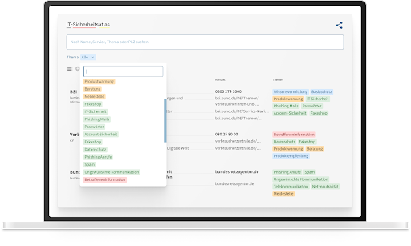

# Sicherheit im digitalen Alltag BSI 2022

## Einleitung: IT-Sicherheit für Bürger:innen

Mit dem IT-Sicherheitsgesetz 2.0 wurde dem Bundesamt für Sicherheit in der Informationstechnik (BSI) die Aufgabe zugewiesen, Verbraucher:innen bei der Abwehr von Gefahren für ihre IT-Sicherheit im digitalen Alltag zu unterstützen. Im Zuge der Erkundung und Identifizierung des Problemraums wurden vier übergreifende Problemfelder identifiziert: Komplexität, mangelnde Sicherheit von IT-Produkten, mangelndes Wissen über Unterstützungsangebote und der durch gesetzliche Vorgaben eingeschränkte Handlungsspielraum des BSI.

## Umsetzung: IT-Sicherheitsatlas und Browsererweiterung

Zur Lösung wurden zwei Lösungsansätze entwickelt. Die erste ist der IT-Sicherheitsatlas, der eine Liste seriöser Akteure enthält, an die sich Verbraucher:innen wenden können, falls der Hersteller auf einen IT-Sicherheitsvorfall nicht reagiert. Das BSI kann Betroffene auch an andere geeignete Akteure weiterleiten. Die zweite Lösung ist eine Browser-Erweiterung, die automatisch vor Gefahren im Internet warnt und Verbraucher:innen auf den IT-Sicherheitsatlas auf der BSI-Webseite verweist. Die Browsererweiterung reduziert die Komplexität des Themas und funktioniert automatisch.

### [Unser Code](https://github.com/ben04/fakeshop-detector/)

## Die Prototypen

### IT-Sicherheitsatlas

Unser IT-Sicherheitsatlas-Prototyp auf der BSI-Website bietet Nutzer:innen eine Orientierungshilfe, um die passenden Ansprechpersonen zu einem bestimmten Thema zu finden. Die Akteure aus der Praxis tragen ihre Kontaktdaten und ihre Expertise selbst ein und können ihr Profil jederzeit aktualisieren. Das BSI kann durch den Atlas Verbraucher:innen gezielt helfen und einen Überblick über die Akteure im Feld, ihren Austauschbedarf und ihr Angebot gewinnen. Der Atlas kann auch in andere Webseiten eingebunden werden. Die Nutzerforschung zeigt, dass viele Menschen standardisierte Sicherheit bevorzugen und sich nicht direkt mit IT-Sicherheit auseinandersetzen wollen.

### Browsererweiterung

Eine Browser-Erweiterung, die automatisch warnt und auf BSI-Warnungen zu IT-Sicherheitslücken verweist. Im Gegensatz zu bestehenden Lösungen entfällt bei dieser Erweiterung die manuelle Prüfung der Online-Shops durch die Verbraucher:innen. Mit dieser Innovation wird das Vertrauen in den Online-Handel gestärkt und Nutzer:innen werden vor möglichen Betrügereien und Sicherheitslücken geschützt.

# Team

# Team

**Carina Schweiger**

Product  Fellow

**Sveta Goldstein**

Design Fellow

**Benjamin Menrad**

Engineering Fellow

# Projektpartner

**Claudia Sachs**

**Maximilian Berndt**

**Matthias Korn**

**Katharina Witterhold**

**Michael Schulze**

**Diana Sachert**

**Hanna Heurer**
